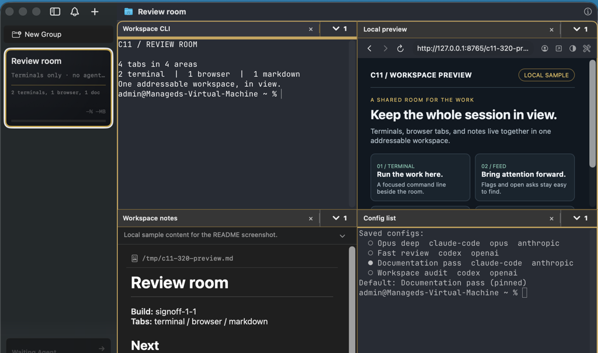
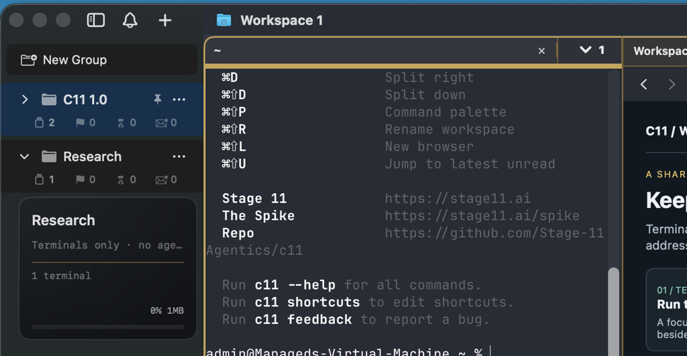
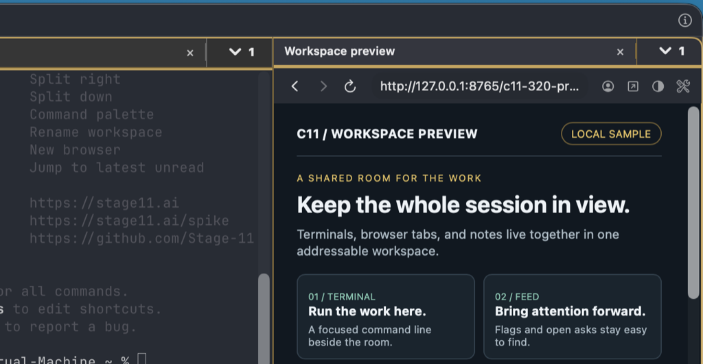

# c11

**c11 terminal multiplexer for the operator:agent pair.**

c11 gives the hyperengineer and their agents a shared workspace for terminals, embedded browsers, and Markdown tabs. Split areas as the work grows. Drive every tab through the CLI or socket.

<!-- WALKTHROUGH VIDEO: C11-124 -->
Walkthrough video: coming soon.



## Workspaces, areas, tabs

A window contains workspaces. Each workspace contains areas. Each area holds terminal, browser, or Markdown tabs. Split areas as the work grows, then move between workspaces without losing their layouts.

Workspace folders group related workspaces in the sidebar. Collapse a folder to hide its member rows while its workspaces stay open. Pin and reorder folders and workspaces independently.



## Agents in the workspace

Launch a supported coding agent in a tab. Give it a title, role, and task. It can split areas, open browser and Markdown tabs, read the workspace tree, and report status to the sidebar. The [c11 skill](skills/c11/SKILL.md) teaches agents to drive these surfaces.

The A-button picker launches a saved configuration or pins it as the default. Open it with `⌘⇧A`. Saved configurations keep an agent and its launch settings together.

## Attention and messages

The Feed gathers open asks and raised flags. Flags keep their priority when an agent is suppressed. Suppression keeps routine worker signals out of the operator's attention list. The Feed points to the exact tab that needs attention.

Use `c11 mailbox send` for durable messages between agent tabs, including across workspaces. Open `c11 messages view` to read the live message timeline and delivery state.

## Browser profiles

The embedded browser lives beside terminals and Markdown tabs. Named profiles keep website data and browser history separate. Switch profiles from a browser tab, or create one from its profile menu.



## Journal and session restore

The lifecycle journal makes agent activity queryable by agent, model, or workspace. Inspect turns, time in state, errors, and stalls with `c11 journal query`. Export the journal as body-free NDJSON.

Workspace snapshots restore layouts and supported agent sessions. c11 resumes exact sessions for Claude Code, Codex, pi, omp, OpenCode, and Grok. Kimi and GitHub Copilot do not support exact-session restore. If a session identity is missing or ambiguous, c11 skips auto-resume instead of choosing another conversation.

## Install

Requires macOS 14 or later.

Download the latest signed DMG from [Releases](https://github.com/Stage-11-Agentics/c11/releases).

Or install with Homebrew:

```bash
brew tap stage-11-agentics/c11
brew install --cask c11
```

### Hardware

Terminals, browser tabs, and agent processes use your Mac's memory while they run. Give large workspaces enough headroom for the agents and pages they hold.

## Learn more

- [Agent skill](skills/c11/SKILL.md)
- [CLI reference](skills/c11/references/api.md)
- [Agent messaging guide](docs/c11-mailbox-guide.md)

## Lineage and license

c11 builds on [cmux](https://github.com/manaflow-ai/cmux), embeds [Ghostty](https://ghostty.org), and uses [Bonsplit](https://github.com/almonk/bonsplit) for tab and split chrome.

AGPL-3.0-or-later. See [LICENSE](LICENSE) and [NOTICE](NOTICE).

c11 is a [Stage 11 Agentics](https://stage11.ai) project.
