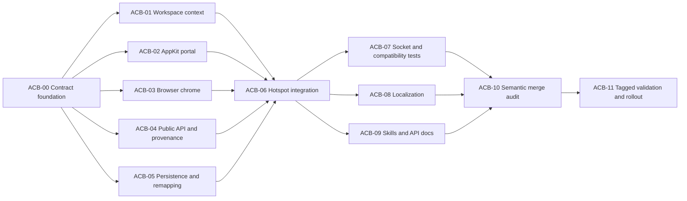

# Agent-Linked Companion Browsers — BUILDPLAN

**Status:** Ready for Lattice orchestration after operator acceptance of this build contract

**Repository baseline inspected:** `workspace-pulse-prototype` at `a9a2f01c1197` (2026-07-22)

**Scope:** Browser surfaces in c11 workspaces

**Source of truth:** [c11-agent-linked-companion-browsers-plan.md](c11-agent-linked-companion-browsers-plan.md)

## 1. Contract, scope, and non-goals

This document converts the approved product and engineering plan into implementation tickets. The source plan's locked decisions, state tables, acceptance criteria, terminology, and latest **Show Surface IDs in Tab Titles** rule are binding. If this build plan and the source plan conflict, the source plan wins; the implementer must stop and correct this document or ticket rather than silently choosing another behavior.

The implementation delivers:

- one typed durable browser-to-agent link;
- workspace-local agent context established only by operator focus or an allowlisted focus-intent command;
- generation-keyed temporary reveal grants;
- a toolbar link/relink/unlink control and a pane-local AppKit veil above WebKit;
- caller-aware automatic linking without changing browser placement;
- descendant-link inheritance;
- session, recent-close, snapshot, and blueprint durability;
- structured CLI/socket query and mutation surfaces;
- live reuse of `TabOrdinalDisplaySettings.showSurfaceIdsInTabTitlesKey` and `TitleFormatting.ordinalPrefixed` for visual identities while machine APIs always expose UUIDs and current refs;
- localization, skills, tagged runtime evidence, and a guarded rollout.

Non-goals remain exactly those in the source plan: no automatic browser switching, pane movement, primary-browser nomination, page suspension, cookie/profile isolation, privacy or authorization boundary, agent-side hook, tenant-config write, generic all-surface relationship graph, or new event taxonomy. Existing Cmd-Shift-T scope is preserved: this work adds link restoration to browser closes already captured by `ClosedBrowserPanelRestoreSnapshot`; it does not broaden recent-close semantics to every browser removed by a whole-pane close.

Two implementation clarifications close gaps found during repository inspection without changing product behavior:

1. Revealing a hibernated browser grants contextual access but does **not** resume it. The existing hibernated placeholder and its explicit resume action remain authoritative; reveal and lifecycle are independent.
2. Explicitly authored blueprint links need a verifiable agent target. `SurfaceSpec` therefore gains optional `declaredAgentKind` and Markdown gains optional `agent_kind:` for terminal declarations. It must satisfy shared `AgentIdentityPolicy`; captured plans populate it from the live descriptor. This avoids guessing from a command string.

## 2. Verified current-state insertion map

No `AgentCompanion*` or `BrowserCompanion*` production symbols exist at the inspected baseline.

| Area | Verified current symbol and behavior | Intended seam |
|---|---|---|
| Agent qualification | `PaneSizePolicy.isAgentKind` in `Sources/PaneSizePolicy.swift` accepts canonical `AgentRegistry` kinds plus `opencode-run`; `AgentChipResolver` in `Sources/AgentChip.swift` currently has a broader fallback. `AgentRegistry.manifest(forKind:)` does not normalize and has no `opencode-run` manifest. | Extract one `AgentIdentityPolicy`; preserve `opencode-run` with a defined fallback name; make pane sizing, chips, context, and link validation use it. Regression-test any chip behavior change. |
| Visual identity preference | `TabOrdinalDisplaySettings` and `TabOrdinalDisplayObserver` are in `Sources/TabManager.swift`; `Workspace` already observes the key live. `TitleFormatting.ordinalPrefixed` in `Sources/TitleFormatting.swift` emits `N: title`; `SurfaceTitleBarView` and app settings use the same key. | Add one pure companion identity formatter that receives the existing Boolean. Live identities delegate to `ordinalPrefixed`; orphan identities never use stale ordinals. SwiftUI uses `@AppStorage`/the existing observer seam. |
| Durable browser state | `BrowserPanel` in `Sources/Panels/BrowserPanel.swift` has a stable UUID and moves as the same object. It has no companion property. | Add `@Published private(set) var linkedAgent`; only Workspace validation or internal restore/inheritance methods mutate it. Do not use `SurfaceMetadataStore` as authority. |
| Workspace state | `Workspace` is `@MainActor`. `focusedPanelId` represents current Bonsplit pane/tab selection for every panel type. `reconcilePanelEvents(newPanels:)` is the central panel lifecycle diff. | Own active context, late-promotion candidate, MRU, reveal grants, validated link mutations, and presentation derivation here. Reconcile close/move/attach without deleting links. |
| Selection convergence | `Workspace.applyTabSelectionNow(...)` is reached through `PendingTabSelectionRequest`; `didSelectTab` and multiple programmatic paths converge there. Existing `shouldTreatCurrentEventAsExplicitFocusIntent()` only inspects `NSApp.currentEvent`, and `markExplicitFocusIntent(on:)` is for non-focus split reassertion. | Thread typed provenance from the entry point through the pending request. Do not repurpose either existing helper as semantic authority. Default low-level/programmatic routes to maintenance. |
| Socket focus intent | `TerminalController.focusIntentV1Commands`, `focusIntentV2Methods`, `withSocketCommandPolicy`, `v2FocusAllowed`, `v2MaybeFocusWindow`, and `v2MaybeSelectWorkspace` allow only focus verbs to change in-app focus. `surface.focus` calls `Workspace.focusPanel`. | Snapshot `.explicitFocusCommand` inside the handler and pass it with selection. Never consult the transient global stack later from an async callback. Non-focus companion mutations retain the current focus contract. |
| Late agent detection | `AgentDetector` calls `SurfaceMetadataStore.setInternal` from a utility queue. `SurfaceMetadataStore` has no typed observation seam; replace, clear, and restore can change/remove `terminal_type`. | Publish only effective terminal-kind changes, including old/new value and origin. Marshal the Workspace consumer to `@MainActor`; no-op/rejected writes emit nothing. |
| Browser chrome | `PanelContentView` constructs `BrowserPanelView`. `BrowserPanelView.addressBar` owns navigation/page controls and has no companion input; it contains live, blank, and hibernated content branches. | Pass immutable presentation, choices, and actions through `PanelContentView`; render the companion control/banner in `addressBar`; gate page-affecting controls from the same value. |
| Portal layering | `WindowBrowserSlotView` in `Sources/BrowserWindowPortal.swift` hosts the WKWebView, inspector siblings, search host, pane drop views, and pane-interaction overlay. `bringInteractionLayersToFrontIfNeeded()` only partially orders layers. `WindowBrowserHostView.hitTest()` is typing-sensitive. | Add a real AppKit companion overlay host and a single `refreshInteractionLayerOrder()`; do not evaluate companion policy in `hitTest()`. Coordinate slot children and the host-level drop overlay. |
| Portal focus/accessibility | `PaneInteractionOverlayHost` already demonstrates responder capture/restoration and swallowed hit testing. There is no WebKit accessibility-suppression precedent. | Reuse that lifecycle shape; cache and restore exact accessibility-hidden state for page and inspector; consume reveal mouse-down/up and Return/Space. Compile-verify the AppKit accessibility API. |
| DevTools/popup topology | `HostContainerView.ensureLocalInlineSlotView()` and `HostedInspectorSideDockContainerView` can place attached DevTools outside the normal slot. `BrowserPopupWindowController` creates a separate `NSPanel`. | Cover the combined local-inline page/inspector container and mirror the opener's veil into popup windows, or keep the feature gated. A slot-only veil is not acceptable. |
| Search/fullscreen/native UI | Search can remain interactive above WebKit. WebKit fullscreen, pointer lock, JS dialogs, file panels, permission prompts, and popup windows may escape a slot-local overlay. Current reliable coverage is not proven. | Close/yield search before veiling; request pointer-lock/fullscreen exit; block/defer page-originated native UI while veiled. These are feasibility/default-enable gates, not polish. |
| Browser descendants | `BrowserPanel.openLinkInNewTab`, `Workspace.duplicateBrowserToRight`, `Workspace.newBrowserSplit`, `Workspace.newBrowserSurface`, and TabManager wrappers create descendants. No verified popup-to-surface promotion helper exists. | Pass `initialLinkedAgent` explicitly through every source-derived path. Never infer inheritance from whichever browser is focused. Add an explicit popup-promotion path if promotion is implemented. |
| CLI creation | `CLI/c11.swift` routes via `runBrowserCommand`; open/new parse placement `--surface`, workspace/window, then call `browser.open_split`. It currently relies mainly on `CMUX_SURFACE_ID`, not a distinct caller field. | Add `caller_surface_id`, prefer `C11_SURFACE_ID` then legacy `CMUX_SURFACE_ID`, and add `--workspace-wide`. Keep `surface_id` placement semantics unchanged. |
| Socket creation | `v2BrowserOpenSplit`, `v2PaneCreate`, and `v2SurfaceCreate` call `Workspace.newBrowser*`; `v2ResolveWorkspace` can derive workspace from `surface_id`, which is currently overloaded for placement. | Resolve target workspace independently; validate caller only for attribution; funnel all browser creation through one result/link helper. |
| Structured queries | `v2SurfaceList` serializes in `SurfaceHandlers.swift`; `v2TreeWorkspaceNode` serializes separately in `TerminalController.swift`; browser tab query lives in `BrowserQueryHandlers.swift`. | Add one shared companion wire serializer so `surface.list`, `system.tree`, and `surface.context.get` return identical state and identity triples. |
| Session persistence | `SessionSnapshotSchema.currentVersion == 1`. `SessionBrowserPanelSnapshot` and `SessionWorkspaceSnapshot` lack companion fields. `Workspace.sessionSnapshot`, `sessionPanelSnapshot`, `restoreSessionSnapshot`, and `createPanel(from:inPane:)` are the bridges. | Add optional fields without bumping schema v1. Restore panels, links, then metadata; validate active context only after `terminal_type` restoration. Never encode reveals/generation. |
| Autosave/recent close | `TabManager.sessionAutosaveFingerprint()` omits companion state. `ClosedBrowserPanelRestoreSnapshot` is staged by Workspace and consumed by `TabManager.reopenClosedBrowserPanel`; reopened browser UUID changes. | Hash context and sorted browser links. Add the link to close snapshots; restore its target UUID through an internal orphan-permitting path. |
| Plans/snapshots | `WorkspacePlanCapture.capture` is one-pass DFS; `WorkspaceLayoutExecutor.WalkState.planSurfaceIdToPanelId` already maps plan IDs to live IDs. `SurfaceSpec` has custom Codable. | Two-pass capture and apply; add optional link and declared-agent fields; defer linking until all panels exist. |
| Blueprint Markdown | Parser mints `sN`, ignores authored IDs, and serializer drops IDs/relationships. Capture/export APIs return no warnings. | Reserve explicit IDs before fallback minting, validate document-wide uniqueness/forward refs, emit IDs for all surfaces, and return structured capture diagnostics. |
| Tests/targets | `c11LogicTests` and `c11Tests` are explicit targets in `project.pbxproj`. Existing relevant members include `TabOrdinalDisplayTests`, `BrowserChromeSnapshotTests`, `BrowserPanelTests`, `SessionPersistenceTests`, and blueprint/apply tests. | The foundation owner alone adds new production/test membership. Pure policy/persistence use `c11-logic`; Workspace/portal behavior uses the safe host wrapper. |
| Localization/skills | `Resources/Localizable.xcstrings` has equal English plus six-locale coverage. `c11` and `c11-browser` are installable entries in `skills/MANIFEST.json`; installed copies are one-time mirrors. | English-only call-site strings first; six fresh translation agents return isolated artifacts; one integrator edits the catalog. Update both skills/API reference, run sync, and diff installed copies. |

Uncertainty is intentionally converted into gates: WebKit auxiliary-window coverage, exact accessibility setter behavior, pointer-lock exit reliability, and popup promotion do not have proven current implementations. ACB-02 must produce runtime evidence or keep the switch default-off.

## 3. Contract-first foundation

`ACB-00` is a serial gate and owns the contract. No downstream implementation branch starts until it merges. The owner freezes these names and semantics in `Sources/AgentCompanionContext.swift`:

```swift
struct AgentSurfaceLink: Codable, Equatable, Sendable {
    var surfaceID: UUID
    var lastKnownName: String?
}

struct CompanionSurfaceIdentity: Equatable, Sendable {
    var surfaceID: UUID
    var surfaceRef: String?
    var surfaceOrdinal: Int?
    var displayName: String
}

struct AgentDescriptor: Equatable, Sendable {
    var identity: CompanionSurfaceIdentity
    var terminalKind: String
}

struct AgentContextState: Equatable, Sendable {
    var activeAgentSurfaceID: UUID?
    var generation: UInt64
}

struct CompanionRevealGrant: Equatable, Hashable, Sendable {
    var browserSurfaceID: UUID
    var linkedAgentSurfaceID: UUID
    var activeAgentSurfaceID: UUID?
    var contextGeneration: UInt64
}

enum BrowserCompanionPresentation: Equatable {
    case unlinked
    case linkedNoContext(linked: AgentDescriptor)
    case aligned(linked: AgentDescriptor)
    case veiled(linked: AgentDescriptor, active: AgentDescriptor)
    case revealed(linked: AgentDescriptor, active: AgentDescriptor)
    case orphaned(link: AgentSurfaceLink)
    case orphanedRevealed(link: AgentSurfaceLink)
}

enum AgentContextFocusProvenance: Equatable, Sendable {
    case operatorInteraction
    case explicitFocusCommand
    case restore
    case maintenance
}

enum BrowserCompanionLinkMode: String, Codable, Sendable {
    case automatic
    case workspace
}

enum BrowserCompanionLinkResult: String, Codable, Sendable {
    case automatic, workspace, noCaller = "no_caller"
    case callerNotFound = "caller_not_found"
    case callerWorkspaceMismatch = "caller_workspace_mismatch"
    case callerNotAgent = "caller_not_agent"
}
```

The same file freezes:

- `AgentIdentityPolicy.isAgentKind(_:)` and descriptor fallback rules;
- `BrowserCompanionPolicy.presentation(...)` as the only state reducer;
- `CompanionIdentityFormatting.live(...showSurfaceIDs:)` and `.orphan(...visibleLinks:showSurfaceIDs:)`;
- stable link validation error cases;
- `BrowserPortalCompanionState`, a closure-free value consumed by portal and SwiftUI code;
- `BrowserPortalCompanionConfiguration(state:onReveal:onHide:)`, whose callbacks are `@MainActor`; both portal and chrome lanes compile against this exact type;
- the canonical `CompanionContextWireSnapshot` field set from the source plan;
- `AgentCompanionBrowserFeature`, default off, using UserDefaults key `c11.agentCompanionBrowser.enabled` and environment override `C11_AGENT_COMPANION_BROWSER_ENABLED` (`1/true/on` or `0/false/off`; environment wins). Disabled means UI/API/automatic linking are absent and stored optional links are dormant but preserved.

It also lands a compile-safe `AgentCompanionWorkspaceAccess` protocol and default-off Workspace conformance so all Wave 1 branches compile independently. ACB-01 replaces the disabled defaults with the real implementation without renaming the interface:

```swift
var liveAgentDescriptors: [AgentDescriptor] { get }
func companionPresentation(for browserID: UUID) -> BrowserCompanionPresentation
func linkBrowser(_ browserID: UUID, toAgent agentID: UUID) throws
func unlinkBrowser(_ browserID: UUID) throws
func revealBrowser(_ browserID: UUID) throws
func hideBrowser(_ browserID: UUID)
func automaticLinkBrowser(
    _ browserID: UUID,
    callerSurfaceID: UUID?,
    mode: BrowserCompanionLinkMode
) -> BrowserCompanionLinkResult
func companionWireSnapshot(for browserID: UUID) -> CompanionContextWireSnapshot?
```

The wire snapshot is exact and independent of the visual preference:

```json
{
  "kind": "agent_companion",
  "browser_surface_id": "uuid",
  "browser_surface_ref": "surface:N",
  "browser_name": "Checkout Prototype",
  "linked_agent_surface_id": "uuid-or-null",
  "linked_agent_surface_ref": "surface:N-or-null",
  "linked_agent_name": "name-or-null",
  "link_state": "unlinked|resolved|orphaned",
  "presentation_state": "unlinked|linked_no_context|aligned|veiled|revealed|orphaned|orphaned_revealed",
  "active_agent_surface_id": "uuid-or-null",
  "active_agent_surface_ref": "surface:N-or-null",
  "active_agent_name": "name-or-null"
}
```

`surface.context.get` takes `surface_id`. `surface.context.link` takes browser `surface_id` plus exactly one of `agent_surface_id` or `active_agent: true`. `surface.context.unlink` takes browser `surface_id`. Mutation responses return the full `context` object. Freeze link-operation error codes as `browser_not_found`, `target_not_browser`, `agent_not_found`, `target_not_terminal`, `link_workspace_mismatch`, `agent_not_recognized`, and `no_active_agent`; reference parsing continues using existing `invalid_params`/ambiguity errors.

Freeze plan/capture diagnostics as `companion_link_orphan_omitted`, `companion_link_source_not_browser`, `companion_link_target_missing`, `companion_link_target_not_terminal`, `companion_link_target_not_agent`, `companion_link_apply_failed`, `blueprint_duplicate_surface_id`, and `blueprint_invalid_agent_kind`. Warnings/errors carry source plan ID, target plan ID when available, and a localized human-readable message at the UI boundary.

Compatibility rules:

- all new persistence fields are optional and schema version stays `1`;
- all new socket request fields are optional and existing calls preserve behavior;
- visual ID preference never enters the durable link or machine serializer;
- V1 adds no event type and never emits `metadata.changed` for a typed link;
- the reducer is AppKit/SwiftUI-free and all downstream UI consumes its output rather than storing `isVeiled` booleans;
- `opencode-run` remains a recognized compatibility agent with a deterministic fallback label;
- `shell`, `unknown`, and noncanonical custom kinds are not link targets.

The foundation owner is also the sole initial owner of `GhosttyTabs.xcodeproj/project.pbxproj`: add `AgentCompanionContext.swift` to `c11`; add `c11Tests/BrowserCompanionPolicyTests.swift` to `c11LogicTests`; and pre-create compile-clean `BrowserCompanionWorkspaceTests.swift`, `BrowserCompanionPortalTests.swift`, and `BrowserCompanionChromeTests.swift` in `c11Tests`. The latter files are membership scaffolds only—no fake assertions—and their Wave 1 owners fill them. No other wave edits the project file unless ownership is explicitly transferred after all parallel branches merge.

## 4. Dependency DAG and execution waves



| Wave | Work | Parallelism | Serial gate |
|---|---|---:|---|
| 0 | ACB-00 | 1 | Contract, target membership, wire/schema names must merge first. |
| 1 | ACB-01 through ACB-05 | 5 | Distinct source hotspots; branches cut from merged ACB-00. Maximum two concurrent `xcodebuild`/test processes. |
| 2 | ACB-06 | 1 | Integration owner receives temporary ownership of cross-cutting hotspots after all five Wave 1 PRs merge. |
| 3 | ACB-07, ACB-09, six ACB-08 locale researchers | 8 | API/English key manifest frozen by ACB-06. Locale researchers do not edit the catalog. |
| 3b | ACB-08 catalog integration | 1 | One writer applies all six artifacts to `Localizable.xcstrings`. |
| 4 | ACB-10 | 1 primary plus up to 3 read-only reviewers | Findings route to former owners; reviewers do not race edits. |
| 5 | ACB-11 | 1 UI driver plus up to 2 artifact reviewers | One process controls the tagged app. Computer-use requires prior operator approval. |

## 5. Parallel task buckets

### ACB-00 — Typed contract, shared identity, and target scaffolding

**Outcome:** Every later bucket compiles against one state model, identity rule, formatter, feature switch, error vocabulary, portal state, and wire shape.

- **Prerequisites/dependents:** none; blocks ACB-01 through ACB-05.
- **Owner specialty:** Swift domain-model/API architect.
- **Exclusive ownership:** `Sources/AgentCompanionContext.swift` (new, including the default-off Workspace adapter), `Sources/AgentManifest.swift`, `Sources/AgentChip.swift`, `Sources/PaneSizePolicy.swift`, `Sources/TitleFormatting.swift`, `GhosttyTabs.xcodeproj/project.pbxproj`, and the four new companion test files/memberships.
- **Must not edit:** Workspace, BrowserPanel/View, portal, persistence, CLI/socket, localization, skills.
- **Frozen inputs/outputs:** types and compatibility rules in Section 3; `AgentIdentityPolicy`; pure formatter; wire snapshot keys; stable error/link-result strings.

Implementation:

1. Add the pure types/reducer/formatter/feature switch.
2. Extract the existing pane-size predicate without changing accepted canonical kinds; explicitly add the `opencode-run` fallback descriptor.
3. Route `PaneSizePolicy` and `AgentChipResolver` through the predicate, preserving intentional shell fallback or documenting/test-fixing the stricter behavior.
4. Make orphan prefix expansion collision-safe across the visible orphan set and forbid stale `surface:n` output.
5. Add exhaustive pure tests for seven presentations, reveal generation, A→B→A, identity/duplicate names, live preference toggling, orphan formatting, and kind validation.
6. Add project membership once.

Verification:

```bash
xcodebuild -project GhosttyTabs.xcodeproj -scheme c11-logic -configuration Debug \
  -destination "platform=macOS" test \
  -only-testing:c11LogicTests/BrowserCompanionPolicyTests \
  -only-testing:c11LogicTests/PaneSizePolicyTests \
  -only-testing:c11LogicTests/AgentManifestTests \
  -only-testing:c11LogicTests/TabOrdinalDisplayTests
```

**Acceptance:** CTX policy truth table, ID-1/2/5/6/7, and PLAT-3 at the pure layer; no ad hoc UI state.

**Durable handoff:** PR with contract diff, exported symbol note, test log, and review artifact; expected boundary is one foundation PR.

### ACB-01 — Workspace context, focus provenance, metadata promotion, and typed links

**Outcome:** The model truthfully derives active context and link presentation without UI, background-activity, or maintenance-selection false positives.

- **Prerequisite/dependents:** ACB-00; blocks ACB-06.
- **Owner specialty:** `@MainActor`, Workspace/Bonsplit lifecycle, metadata concurrency.
- **Exclusive ownership:** `Sources/Workspace.swift`, the Workspace adapter portion of `Sources/AgentCompanionContext.swift`, `Sources/SurfaceMetadataStore.swift`, `Sources/AgentDetector.swift` only if needed for typed publication wiring, `Sources/Panels/BrowserPanel.swift`, `c11Tests/SurfaceMetadataStoreValidationTests.swift`, and `c11Tests/BrowserCompanionWorkspaceTests.swift`.
- **Must not edit:** `TabManager.swift`, `AppDelegate.swift`, BrowserPanelView/portal, persistence plan files, CLI/socket, `project.pbxproj`.
- **Inputs/outputs:** ACB-00 types; exposes validated Workspace `linkBrowser`, `unlinkBrowser`, `revealBrowser`, `hideBrowser`, `companionPresentation`, a read-only live-agent list, and explicit internal restore/inheritance methods.

Implementation:

1. Add context state, explicit-focus late-promotion candidate, MRU, and reveal map to Workspace.
2. Thread provenance through `PendingTabSelectionRequest`, `applyTabSelection`, `applyTabSelectionNow`, `focusPanel`, and audited entry points. Default programmatic/restore paths to non-establishing provenance; pass explicit values from Bonsplit user callbacks and focus commands.
3. At convergence, update context only for explicit provenance plus a recognized terminal. Browser/markdown/shell focus preserves context. Explicit focus of an unknown terminal records a candidate without replacing context.
4. Add a typed terminal-kind change stream that covers merge, replace removal, keyed clear, clear-all, `setInternal`, and restore origins; suppress rejected/no-op writes. Consume on `@MainActor`.
5. Promote only a still-effective explicitly focused candidate. Demotion of the active agent clears context, increments generation, revokes reveals, and orphans its links.
6. Add `BrowserPanel.linkedAgent` and internal `initialLinkedAgent`/restore mutation, preserving typed state across detach/attach.
7. Centralize validation, descriptor resolution, last-known-name refresh, lifecycle reconciliation, and reveal invalidation. Use `newPanels` inside `reconcilePanelEvents`; add a post-attach reconciliation if insertion fires too early.
8. Preserve vetoed-close state and avoid writes in typing/draw/tab-row paths.

Verification:

```bash
xcodebuild -project GhosttyTabs.xcodeproj -scheme c11-logic -configuration Debug \
  -destination "platform=macOS" test \
  -only-testing:c11LogicTests/SurfaceMetadataStoreValidationTests

C11_AGENT_COMPANION_BROWSER_ENABLED=1 \
  scripts/test-unit-local.sh -only-testing:c11Tests/BrowserCompanionWorkspaceTests
```

**Acceptance:** CTX-1 through CTX-7, UX-4/5/6/8 model behavior, cross-workspace validation, many-browser links, no background activity effect, and no focus mutation from link calls.

**Durable handoff:** one PR with a provenance call-site audit table, metadata transition matrix, host-test log, and review artifact.

### ACB-02 — AppKit veil, WebKit inertness, and portal feasibility

**Outcome:** A mismatch is visibly and interactively blocked above page and inspector content while c11 chrome remains usable; first reveal activation cannot click through.

- **Prerequisite/dependents:** ACB-00; blocks ACB-06 and default enablement.
- **Owner specialty:** AppKit responder chain, WebKit portals, accessibility.
- **Exclusive ownership:** `Sources/BrowserWindowPortal.swift` (define `BrowserCompanionOverlayHost` in this file to avoid a new membership collision) and `c11Tests/BrowserCompanionPortalTests.swift`.
- **Must not edit:** BrowserPanelView/PanelContentView, Workspace/TabManager/AppDelegate, BrowserPanel, CLI/socket, localization, project file.
- **Inputs/outputs:** consumes `BrowserPortalCompanionState`; publishes portal configuration setters/callback hooks with deterministic ordering.

Implementation:

1. Add portal companion configuration parallel to search and pane interaction.
2. Implement an AppKit host using the pane-interaction overlay lifecycle: real hit-test target, responder capture/restoration, Return/Space action, consumed mouse-down/up, and no unhandled-key fallthrough.
3. Cache/restore exact page and inspector accessibility-hidden values on veil, reveal, replacement, unbind, and deinit; keep the veil accessible.
4. Replace partial re-raising with `refreshInteractionLayerOrder()` after every setter, bind/rebind, reparent, inspector add, and geometry synchronization. Enforce modal > drag > veil > search > WebKit/inspector across slot and host-level views.
5. Close/yield search before activating the veil and reacquire veil focus after a higher modal closes.
6. Cover local-inline/side-dock DevTools at the combined container level.
7. Mirror veil state into popup `NSPanel` topology or block/defer it; add explicit popup-promotion plumbing if none exists.
8. Gate page-originated JS dialogs, permission/file sheets, fullscreen, and pointer lock. Request standards/WebKit exit and refuse “safe veil established” until coverage is proven.

Verification:

```bash
xcodebuild -project GhosttyTabs.xcodeproj -scheme c11 -configuration Debug \
  -destination "platform=macOS" build

C11_AGENT_COMPANION_BROWSER_ENABLED=1 \
  scripts/test-unit-local.sh -only-testing:c11Tests/BrowserCompanionPortalTests
```

**Acceptance:** UX-2/3/7/9, PLAT-1/2, deterministic ordering, exact accessibility restoration, event consumption, popup/DevTools coverage. Fullscreen/native-sheet uncertainty must become either passing tagged evidence or a default-enable blocker.

**Durable handoff:** one portal PR with layer diagram, responder/accessibility state table, host-test result, and a feasibility artifact listing every proven/unproven WebKit topology. Flag the generic occlusion host as a possible cmux upstream contribution; companion semantics remain c11-only.

### ACB-03 — Browser toolbar, chooser, banner, placeholders, and live ID preference

**Outcome:** Operators can link/relink/unlink from always-visible chrome, understand mismatch/reveal state, and see IDs appear/disappear live everywhere without changing identity.

- **Prerequisite/dependents:** ACB-00; blocks ACB-06.
- **Owner specialty:** SwiftUI browser chrome, adaptive layout, accessibility copy.
- **Exclusive ownership:** `Sources/Panels/PanelContentView.swift`, all of `Sources/Panels/BrowserPanelView.swift`, `c11Tests/BrowserChromeSnapshotTests.swift`, and `c11Tests/BrowserCompanionChromeTests.swift`.
- **Must not edit:** portal, Workspace/TabManager/AppDelegate, ContentView/c11App commands, domain file, localization catalog, CLI/socket, project file.
- **Inputs/outputs:** consumes Workspace-provided immutable presentation, identities, choices, and closures plus ACB-02 portal setter signatures; emits only localized English call-site keys for ACB-08.

Implementation:

1. Pass presentation/actions from `PanelContentView`; do not add Workspace observation to `TabItemView` or metadata lookup to its body.
2. Add adaptive toolbar pill/menu, active-agent shortcut, chooser, checked link, and unlink action.
3. Disable omnibar/back/forward/reload/devtools/page controls while veiled; leave link control and c11 pane/tab chrome enabled.
4. Render the revealed mismatch/Hide treatment inside existing browser chrome without covering or resizing the web viewport.
5. Add the page-region veil treatment for blank/hibernated states; reveal does not resume hibernation.
6. Use the same `@AppStorage(TabOrdinalDisplaySettings.showSurfaceIdsInTabTitlesKey)` seam and pure formatter for pill, veil, chooser, banner, tooltip, menu, and accessibility labels.
7. Use directional copy for browser, linked agent, and active agent; duplicate names gain kind/model context without resolving by text.
8. Thread ACB-02 configuration through `WebViewRepresentable` and local-inline hosts.

Verification:

```bash
xcodebuild -project GhosttyTabs.xcodeproj -scheme c11 -configuration Debug \
  -destination "platform=macOS" build

C11_AGENT_COMPANION_BROWSER_ENABLED=1 \
  scripts/test-unit-local.sh -only-testing:c11Tests/BrowserCompanionChromeTests
```

**Acceptance:** UX-2/4/9/10 and ID-1 through ID-7 across wide/narrow, Light/Dark theme slots, contrast/transparency, keyboard, and VoiceOver semantics.

**Durable handoff:** one chrome PR with key manifest, adaptive-state screenshots from a tagged build only if approval already exists, and test/review artifacts.

### ACB-04 — Creation provenance, link APIs, query serializer, CLI, and compatibility

**Outcome:** An agent-created browser links to the validated caller regardless of operator focus; manual/workspace-wide creation remains unlinked; canonical queries expose all states without stealing focus.

- **Prerequisite/dependents:** ACB-00; blocks ACB-06/07/09.
- **Owner specialty:** CLI grammar, socket routing, additive JSON compatibility.
- **Exclusive ownership:** `CLI/c11.swift`, `Sources/SocketHandlers/BrowserHandlers.swift`, `Sources/SocketHandlers/SurfaceHandlers.swift`, `Sources/SocketHandlers/PaneHandlers.swift`, `Sources/SocketHandlers/BrowserQueryHandlers.swift`, query-related `Sources/TerminalController.swift`, and new `tests_v2/test_agent_companion_browser_context.py` (authored but runtime execution waits for tagged integration).
- **Must not edit:** Workspace/TabManager/AppDelegate/BrowserPanel, portal/UI, persistence, skills/API docs, localization, project file.
- **Inputs/outputs:** ACB-00 link modes/results/wire snapshot and ACB-01 Workspace APIs. Request fields: `caller_surface_id`, `link_mode`; response fields: `link_result`, linked identity. Methods: `surface.context.get/link/unlink`.

Implementation:

1. In `runBrowserCommand`, parse `--workspace-wide` independently of URL assembly. For creation only, set caller from `C11_SURFACE_ID` then `CMUX_SURFACE_ID` unless a different workspace/window is explicitly targeted.
2. Keep `surface_id` as existing target/placement source. Resolve workspace from routing fields before caller validation; caller can never retarget.
3. Make browser open, `surface.create --type browser`, `pane.create --type browser`, `new-surface`, and `new-pane` use one attribution helper and the exact invalid-caller outcomes.
4. Reject malformed caller refs before creation; stale/cross-workspace/non-agent cases create unlinked with documented `link_result`.
5. Add link/get/unlink handlers and CLI verbs. They are data mutations, excluded from focus allowlists, and must preserve app/window/workspace/pane/surface focus.
6. Add one shared serializer used by `v2SurfaceList`, `v2TreeWorkspaceNode`, `surface.context.get`, and browser tab queries. Always include names, live refs or null, and UUIDs; never consult visual ID preference.
7. Keep V1 event-neutral. Update CLI help in the same PR; defer skills/reference prose to ACB-09.
8. Add request/response and omission compatibility tests; syntax-check Python locally, run behavior only against a tagged socket later.

Verification:

```bash
xcodebuild -project GhosttyTabs.xcodeproj -scheme c11-cli -configuration Debug \
  -destination "platform=macOS" build

python3 -m py_compile tests_v2/test_agent_companion_browser_context.py
```

**Acceptance:** API-1 through API-5/7, ID-8, exact caller outcomes, and focus invariance.

**Durable handoff:** one public-API PR with protocol table, CLI help snapshot, compatibility notes, compiled test file, and review artifact.

### ACB-05 — Session, recent-close, snapshots, blueprints, and two-pass remapping

**Outcome:** Links/context survive the intended persistence families, forward references remap correctly, orphans are honest, old artifacts decode, and reveals never persist.

- **Prerequisite/dependents:** ACB-00; blocks ACB-06.
- **Owner specialty:** Codable compatibility, plan compiler/executor, fixtures.
- **Exclusive ownership:** `Sources/SessionPersistence.swift`, `WorkspaceApplyPlan.swift`, `WorkspacePlanCapture.swift`, `WorkspaceLayoutExecutor.swift`, `WorkspaceBlueprintMarkdown.swift`, `WorkspaceBlueprintExporter.swift`, `Sources/SocketHandlers/SnapshotHandlers.swift` for structured capture warnings, snapshot converter/capture files as required, and their existing pure tests/fixtures.
- **Must not edit:** Workspace/TabManager/BrowserPanel/AppDelegate, portal/UI, CLI, socket handlers other than its owned `SnapshotHandlers.swift`, or project file.
- **Inputs/outputs:** optional session/plan fields, `WorkspacePlanCaptureResult(plan:warnings:)`, stable diagnostics, and deferred-link application hook consumed by ACB-06.

Implementation:

1. Add optional `linkedAgent`, `activeAgentSurfaceId`, `linkedAgentSurfacePlanId`, and `declaredAgentKind`; update custom Codable explicitly and keep schema/plan version 1.
2. Refactor capture to first assign plan IDs in existing Bonsplit/tab order, then emit specs and translate links through the complete map.
3. Return structured warnings. Orphaned/missing live targets are omitted and warn; do not hide the outcome in logs.
4. Refactor apply to materialize all surfaces, then resolve/validate links through `planSurfaceIdToPanelId`; return stable missing/not-agent/apply-failed diagnostics.
5. Parse optional Markdown `id:`, `agent_kind:`, and `linked_agent:`. Reserve all explicit IDs before fallback `sN`, validate uniqueness and forward references after parse, and emit explicit IDs for all surfaces.
6. Keep active context out of snapshots/blueprints; only live session persists it. Begin plan apply with nil context.
7. Add pre-feature session-v1, browser-before-agent, duplicate-ID, invalid-kind, orphan-warning, and reveal-absence fixtures.
8. Define internal bridge values for Workspace/TabManager integration; do not reach into those hotspots in this wave.

Verification:

```bash
xcodebuild -project GhosttyTabs.xcodeproj -scheme c11-logic -configuration Debug \
  -destination "platform=macOS" test \
  -only-testing:c11LogicTests/SessionPersistenceTests \
  -only-testing:c11LogicTests/WorkspaceApplyPlanCodableTests \
  -only-testing:c11LogicTests/WorkspaceBlueprintMarkdownTests \
  -only-testing:c11LogicTests/WorkspaceSnapshotCaptureTests

scripts/test-unit-local.sh \
  -only-testing:c11LogicTests/WorkspaceLayoutExecutorAcceptanceTests
```

**Acceptance:** PER-1/2/3/4/5/6 at the schema/compiler layer; forward references, actionable warnings, no reveal/generation encoding.

**Durable handoff:** one persistence PR with schema diff, old-fixture proof, capture/apply diagnostic table, and review artifact.

### ACB-06 — Serial hotspot integration, lifecycle completion, descendants, and commands

**Outcome:** The five parallel lanes become one coherent runtime with no transient wrong presentation, missing lifecycle invalidation, or shared-file conflict.

- **Prerequisites/dependents:** merged ACB-01 through ACB-05; blocks ACB-07/08/09.
- **Owner specialty:** senior integration engineer familiar with Workspace/TabManager/AppDelegate and browser creation.
- **Exclusive ownership after explicit transfer:** `Sources/Workspace.swift`, `TabManager.swift`, `AppDelegate.swift`, `AppleScriptSupport.swift`, `Panels/BrowserPanel.swift`, `Panels/BrowserPopupWindowController.swift`, `ContentView.swift`, `c11App.swift`, and the focus-provenance call sites in `SocketHandlers/SurfaceHandlers.swift`; integration-only corrections in Wave 1 hotspots happen serially here.
- **Must not edit:** localization catalog, skills, tests_v2 owned by ACB-07, source plan, unrelated dirty paths.
- **Inputs/outputs:** all merged interfaces; freezes final English key manifest and public API shape.

Implementation:

1. Wire session capture/restore in the required order: stable panels, orphan-permitting links, terminal metadata, validated active context, maintenance focus, presentation, no reveals.
2. Add context and deterministically sorted browser links to `TabManager.sessionAutosaveFingerprint`; exclude reveal/generation.
3. Add the link to `ClosedBrowserPanelRestoreSnapshot`, `stageClosedBrowserRestoreSnapshotIfNeeded`, and `reopenClosedBrowserPanel`; restore through `initialLinkedAgent` before first presentation.
4. Revoke reveals synchronously on workspace deselection, app resignation, window resign-key, browser focus loss, move, relink/unlink, and context generation. Do not revoke for first-responder movement within the same browser chrome.
5. Pass source links explicitly through `openLinkInNewTab`, duplicate/open-to-side/split/context-menu/target-blank/popup promotion. Manual creation supplies nil; remapped multi-surface plans use plan IDs.
6. Preserve typed links through `DetachedSurfaceTransfer`; validate temporary metadata loss and late reclassification after cross-workspace moves.
7. Snapshot explicit provenance in `surface.focus` and AppleScript focus entry points; never defer lookup of the socket policy stack.
8. Register localized menu-bar and command-palette actions for link/change/unlink/view/hide, without adding focus side effects.
9. Resolve all Wave 1 integration failures at interface seams; route semantic defects back to the owning bucket rather than redesigning silently.
10. Run focus/geometry invariance and vetoed-close tests.

Verification:

```bash
C11_AGENT_COMPANION_BROWSER_ENABLED=1 \
  scripts/test-unit-local.sh -only-testing:c11Tests/BrowserCompanionWorkspaceTests

xcodebuild -project GhosttyTabs.xcodeproj -scheme c11-logic -configuration Debug \
  -destination "platform=macOS" test \
  -only-testing:c11LogicTests/BrowserCompanionPolicyTests \
  -only-testing:c11LogicTests/SessionPersistenceTests

xcodebuild -project GhosttyTabs.xcodeproj -scheme c11 -configuration Debug \
  -destination "platform=macOS" build
```

**Acceptance:** all CTX, UX, API-6, and PER criteria; no geometry/tab selection mutation; link exists before descendant/restored content first renders; vetoed close is a no-op.

**Durable handoff:** one integration PR with merge SHAs, call-site provenance audit, lifecycle matrix, focused test logs, and semantic review artifact.

### ACB-07 — Tagged socket/CLI and backward-compatibility suite

**Outcome:** The public contract is proven against a running tagged app, including focus preservation and every live presentation state.

- **Prerequisite/dependents:** ACB-06; blocks ACB-10.
- **Owner specialty:** Python socket harness and CLI compatibility.
- **Exclusive ownership:** `tests_v2/test_agent_companion_browser_context.py`, companion fixtures/helpers under `tests_v2/`, CI test registration only if discovery does not already include the file.
- **Must not edit:** production source, docs/skills, localization, project file.
- **Inputs/outputs:** frozen ACB-04 API and ACB-06 runtime.

Implementation/testing:

1. Cover valid/stale/missing/malformed/cross-workspace/non-agent callers and `--workspace-wide`.
2. Cover all link/get/unlink validation errors and UUID/ref/name triples.
3. Query unlinked, linked-no-context, aligned, veiled, revealed, orphaned, and orphaned-revealed via all canonical query surfaces.
4. Snapshot macOS activation, selected workspace, pane, and surface before/after non-focus commands.
5. Verify old requests omitting new fields and existing browser placement/reuse behavior.
6. Verify addressed browser automation continues while human state remains veiled.

Exact safe runtime commands on the merged ACB-06 base plus this test branch:

```bash
C11_AGENT_COMPANION_BROWSER_ENABLED=1 C11_QA_LAUNCH=fresh \
  ./scripts/reload.sh --tag agent-companion-api

C11_SOCKET=/tmp/c11-debug-agent-companion-api.sock \
  python3 tests_v2/test_agent_companion_browser_context.py

C11_SOCKET=/tmp/c11-debug-agent-companion-api.sock \
  ./scripts/run-tests-v2.sh
```

Never point these tests at the production socket or an untagged DEV app.

**Acceptance:** API-1 through API-7 and ID-8 observable at runtime; no regression in existing tests_v2.

**Durable handoff:** test PR plus tagged-socket log and before/after focus oracle in a validation artifact.

### ACB-08 — Six-locale translation fan-out and single catalog integration

**Outcome:** Every new English key is complete in Japanese, Ukrainian, Korean, Simplified Chinese, Traditional Chinese, and Russian without simultaneous edits to the catalog.

- **Prerequisite/dependents:** ACB-06 English key freeze; blocks ACB-10.
- **Owner specialty:** one locale-native/fresh agent per locale plus one catalog integrator.
- **Exclusive ownership:** only the integrator edits `Resources/Localizable.xcstrings`.
- **Must not edit:** product code, skills, tests, any other source.
- **Inputs/outputs:** ACB-06 key manifest. `ACB-08-JA`, `-UK`, `-KO`, `-ZH-HANS`, `-ZH-HANT`, and `-RU` each attach a key→translation JSON/Markdown artifact to Lattice and make no repo edit.

Implementation:

1. Six fresh agents translate independently, preserving directional meaning, `linked` terminology, placeholders, and accessibility speech.
2. One integrator validates placeholder parity and applies all artifacts to the catalog.
3. Confirm every catalog key has all seven localizations and no untranslated English fallback introduced by the change.

Integrity command:

```bash
jq -e '[.strings[] | (.localizations // {}) | keys | sort] | all(. == ["en","ja","ko","ru","uk","zh-Hans","zh-Hant"])' \
  Resources/Localizable.xcstrings
```

**Acceptance:** PLAT-4 localization half and all new UI copy in six shipped locales.

**Durable handoff:** six locale artifacts plus one catalog-only commit/PR and integrator review artifact.

### ACB-09 — c11/c11-browser skills, API reference, help parity, and installed sync

**Outcome:** Agents know automatic linking, workspace-wide opt-out, explicit mutations, query shape, reveal semantics, and visual-ID preference behavior.

- **Prerequisite/dependents:** ACB-06 API/key freeze; blocks ACB-10.
- **Owner specialty:** agent-facing technical documentation.
- **Exclusive ownership:** `skills/c11/SKILL.md`, `skills/c11/references/api.md`, `skills/c11-browser/SKILL.md`.
- **Must not edit:** production source, catalog, tests, manifest, global instructions.
- **Inputs/outputs:** frozen CLI/socket behavior; installed-copy evidence.

Implementation:

1. Teach automatic caller linking and `--workspace-wide` without implying ownership/security.
2. Document link/unlink/get commands, structured identity triples, presentation state, and focus preservation.
3. Explain that visual IDs track the existing setting live while JSON is canonical and unaffected.
4. Document automation-through-veil versus human/accessibility blocking.
5. Sync every installed installable skill and verify the two changed installed copies.

```bash
scripts/sync-installed-skills.sh
diff -ru --exclude=.c11-skill.json skills/c11 "$HOME/.claude/skills/c11"
diff -ru --exclude=.c11-skill.json skills/c11-browser "$HOME/.claude/skills/c11-browser"
```

The shell uses `$HOME` here as a read-only conventional destination, not as a reassigned scratch variable.

**Acceptance:** PLAT-4 skills half; source and live installed copies match.

**Durable handoff:** one docs/skills PR, command transcript, installed-copy diff evidence, and review artifact.

### ACB-10 — Merge consolidation and independent semantic audit

**Outcome:** A merged-main candidate satisfies the locked plan as a system, not merely as green independent branches.

- **Prerequisites/dependents:** ACB-07/08/09; blocks ACB-11.
- **Owner specialty:** integration lead; up to three fresh read-only reviewers for domain, portal/accessibility, and persistence/API.
- **Exclusive ownership:** integration branch and `project.pbxproj` after formal ownership transfer; reviewers edit nothing.
- **Must not edit:** source plan. Any fix is assigned serially to its former owner or integration owner.
- **Inputs/outputs:** consumes every merged PR, locale artifact, skill-sync proof, and the frozen acceptance map; outputs one reviewable consolidated SHA and signed semantic verdicts.

Steps:

1. Merge with `--ff-only` where possible in order ACB-00, ACB-01, ACB-02, ACB-03, ACB-04, ACB-05, ACB-06, then 07/08/09.
2. Confirm project membership once and no duplicate build-file entries.
3. Run pure, host, CLI build, Markdown/catalog integrity, and `git diff --check` gates.
4. Audit each locked rule and acceptance ID against executable tests or an explicit ACB-11 scenario.
5. Confirm no source-grep XCTest, no persisted reveal, no new event, no focus side effect, no `TabItemView` observation, and no terminal hot-path work.
6. Attach reviewer verdicts; resolve every blocker before tagging.

Verification:

```bash
xcodebuild -project GhosttyTabs.xcodeproj -scheme c11-logic -configuration Debug \
  -destination "platform=macOS" test \
  -only-testing:c11LogicTests/BrowserCompanionPolicyTests \
  -only-testing:c11LogicTests/SessionPersistenceTests

C11_AGENT_COMPANION_BROWSER_ENABLED=1 scripts/test-unit-local.sh \
  -only-testing:c11Tests/BrowserCompanionWorkspaceTests \
  -only-testing:c11Tests/BrowserCompanionPortalTests \
  -only-testing:c11Tests/BrowserCompanionChromeTests

xcodebuild -project GhosttyTabs.xcodeproj -scheme c11-cli -configuration Debug \
  -destination "platform=macOS" build
xcodebuild -project GhosttyTabs.xcodeproj -scheme c11 -configuration Debug \
  -destination "platform=macOS" build
git diff --check origin/main...HEAD
```

**Acceptance:** every source-plan criterion maps to passing automated evidence or a named tagged scenario; no unresolved P0/P1 semantic finding.

**Durable handoff:** consolidated PR/merge SHA, three review artifacts, acceptance traceability table, and green build/test logs.

### ACB-11 — Tagged runtime validation, rollout decision, and release gate

**Outcome:** A tagged app proves geometry stability, portal blocking, accessibility, persistence, public API, and performance; only then can the feature default change.

- **Prerequisite:** ACB-10.
- **Owner specialty:** tagged-build validator with AppKit/accessibility experience.
- **Exclusive ownership:** validation artifacts and feature-switch default after verdict; no unrelated code.
- **Must not edit:** feature semantics, source plan, unrelated production paths, or validation fixtures while a scenario is running. Findings return to the responsible owner.
- **Inputs/outputs:** consumes the consolidated SHA, exact scenario matrix, tagged socket tests, and recorded approval; outputs a validation artifact and a separate default-enable/hold decision.
- **Approval:** request and record operator approval before computer-use. Record tagged app/window, permitted local pages/domains, interactions, screenshot destinations, and credential/data limits.

Build/launch:

```bash
C11_AGENT_COMPANION_BROWSER_ENABLED=1 C11_QA_LAUNCH=fresh \
  ./scripts/reload.sh --tag agent-companion-browser
# For relaunch of the existing tag:
C11_AGENT_COMPANION_BROWSER_ENABLED=1 \
  ./scripts/launch-tagged-automation.sh agent-companion-browser --qa fresh

C11_SOCKET=/tmp/c11-debug-agent-companion-browser.sock \
  python3 tests_v2/test_agent_companion_browser_context.py
```

Run the source plan's full 14-scenario visual matrix, including destructive-click probe, relink while veiled, live ID toggle in every visual/accessibility location, duplicate names, rename stability, devtools/search/dialog/permission/media/pointer-lock/fullscreen, move/reopen/restart/snapshot/blueprint, narrow layout, VoiceOver, themes/contrast/transparency/reduced motion, and addressed automation while veiled. Capture screenshots and socket state before/after geometry/focus operations. Inspect `c11 tree --no-layout` and rebalance unreadable panes before claiming success.

**Acceptance:** all CTX/UX/ID/API/PER/PLAT criteria, tagged tests_v2, no click-through, underlying accessibility absent, focus/geometry invariant, and no observed typing/focus regression.

**Durable handoff:** validation-role artifact containing tag, commit, environment, approval scope, screenshots, socket transcripts, test logs, performance observations, and explicit default-enable/hold verdict. E2E is triggered with `gh workflow run test-e2e.yml`; never run it locally. If enabled, the switch-default change is its own focused commit/PR after the verdict; validation never hides that mutation inside an evidence commit.

## 6. Hotspot ownership matrix

Ownership transfers are serial and recorded in Lattice. “Integration” means ACB-06 may edit only after the Wave 1 owner has merged and stopped.

| Hotspot | Primary owner | Later owner | Collision rule |
|---|---|---|---|
| `Sources/Workspace.swift` | ACB-01 | ACB-06 | No persistence/UI/API agent edits it in Wave 1. |
| `Sources/Panels/BrowserPanel.swift` | ACB-01 | ACB-06 | Descendant inheritance waits for integration; storage lands first. |
| `Sources/SurfaceMetadataStore.swift` | ACB-01 | findings route to ACB-01 | No generic metadata refactor. |
| `Sources/BrowserWindowPortal.swift` | ACB-02 | ACB-06 only for seam fixes | One portal owner; central order helper only. |
| `Sources/Panels/BrowserPanelView.swift` | ACB-03 | ACB-06 only for seam fixes | One owner covers toolbar, placeholders, DevTools threading. |
| `Sources/Panels/PanelContentView.swift` | ACB-03 | ACB-06 | No Workspace owner edits view plumbing. |
| `Sources/TabManager.swift` | ACB-06 | none | Although settings live here, ACB-00/03 reuse APIs without editing it. |
| `Sources/AppDelegate.swift` | ACB-06 | none | Deactivation/menu/move integration stays serial. |
| `Sources/ContentView.swift`, `Sources/c11App.swift` | ACB-06 | none | Command/menu registration after chrome APIs merge. |
| `Sources/SessionPersistence.swift` | ACB-05 | ACB-06 only if bridge compile requires | Schema owner is exclusive. |
| `WorkspaceApplyPlan/Capture/LayoutExecutor/BlueprintMarkdown` | ACB-05 | ACB-06 only for adapter seam | One plan compiler owner. |
| `CLI/c11.swift` | ACB-04 | findings route to ACB-04 | Public grammar never split across agents. |
| Browser/Surface/Pane/Query socket handlers | ACB-04 | findings route to ACB-04 | One attribution/serializer owner. |
| `GhosttyTabs.xcodeproj/project.pbxproj` | ACB-00 | ACB-10 after transfer | Never edited concurrently; accept gem normalization if used and validate semantically. |
| `Resources/Localizable.xcstrings` | ACB-08 integrator | none | Locale agents submit artifacts only. |
| c11 and c11-browser skills/API | ACB-09 | none | Sync after the docs commit. |
| Source plan | nobody | nobody | Binding, read-only input. |

## 7. Merge and integration protocol

1. ACB-00 merges first. Rebase all five Wave 1 worktrees on that exact commit.
2. Each Wave 1 owner publishes its interface note before implementation review; no bucket changes a frozen contract unilaterally.
3. ACB-01 through ACB-05 run concurrently with exclusive files above. At most two simultaneous Xcode build/test processes protect operator machine responsiveness.
4. Semantic review happens inside each PR against its assigned source-plan acceptance IDs. Green compilation alone is insufficient.
5. Merge Wave 1 in the order ACB-01, ACB-02, ACB-03, ACB-04, ACB-05. Order does not express semantic priority; it makes ACB-06's conflict resolution reproducible.
6. Cut ACB-06 only from the branch containing all five. That owner stitches `Workspace`, `TabManager`, `AppDelegate`, descendants, restoration, and command surfaces and resolves interface drift.
7. Freeze public API and English keys at ACB-06 merge. Then launch ACB-07, ACB-09, and six locale researchers.
8. The localization integrator lands after all six artifacts. ACB-09 syncs installed skills after its source commit.
9. ACB-10 assembles merged main, performs fresh semantic reviews, and routes defects back serially. No reviewer “drive-by fixes” a former owner's hotspot.
10. ACB-11 validates a tag built from the consolidated commit. Default enablement is a separate small commit only after a positive validation verdict and required CI.

Every submodule stays untouched. If portal factoring reveals a generic cmux improvement, record an upstream suggestion rather than creating a Bonsplit/Ghostty submodule divergence in this feature.

## 8. Test and validation matrix

| Layer | Required evidence | Safe execution |
|---|---|---|
| Pure policy/identity | Seven states, generation grants, validation, kind predicate, live/orphan formatting, setting toggle without state mutation | `c11-logic` narrowed commands in ACB-00/01 |
| Metadata transitions | merge/replace/keyed clear/clear-all/internal/restore, no-op/rejected suppression, off-main delivery and main-actor consumption | `c11-logic`; no source-text assertions |
| Workspace host | explicit versus maintenance/restore focus, late promotion/demotion, close/veto/move/reunite, reveal lifetime, geometry/selection invariance | `scripts/test-unit-local.sh`; never raw local `c11-unit` |
| Portal host | bind/rebind/order, click/key consumption, responder/accessibility restoration, search, modal, DevTools, popup, teardown | `scripts/test-unit-local.sh` and tagged scenarios |
| Persistence fixtures | pre-feature decode, link/context round trip, fingerprint-only changes, absent-agent orphan, browser-before-agent remap, diagnostics, reveal absence | pure Codable tests; host wrapper where a Workspace is constructed |
| CLI/socket | caller outcomes, link mutations, all query states/identity triples, focus preservation, omitted-field compatibility | tagged socket only; `C11_SOCKET=/tmp/c11-debug-<tag>.sock` |
| Localization | seven locales per new key, placeholder parity, English call-site localization | catalog integrity script plus fresh-agent artifacts |
| Accessibility | veil is target, page/inspector absent while veiled, names always spoken, IDs only when preference enabled, other panes reachable | tagged VoiceOver/computer-use after approval |
| Visual/runtime | complete source-plan matrix, screenshots, tree/geometry/focus socket oracles, Light/Dark c11 themes and system accessibility settings | tagged build with `C11_QA_LAUNCH`; no untagged app |
| E2E/CI | macOS build, logic/host tests, compatibility, UI suite | GitHub Actions; `gh workflow run test-e2e.yml`, never local E2E |

Tests must exercise runtime behavior or built artifacts. Do not add source-grep, AST, signature, plist-source, pbxproj-text, or localization-source XCTest assertions. `build-for-testing` is not test evidence. If a local `c11-logic` slice constructs Workspace and hits the documented `NSApp == nil` crash, run that slice through the safe host wrapper or leave execution to CI with an explicit note; do not diagnose it as a feature regression.

## 9. Rollout, rollback, telemetry, and release gates

`AgentCompanionBrowserFeature` is default-off through ACB-10. The switch gates automatic links, mutation methods, companion UI, veil, and context query projection as one unit. Optional stored fields remain decodable/preserved while disabled so rollback is non-destructive. There is no half-mode where the link actively affects product behavior without a proven veil.

Default enablement is blocked by any of:

- page/inspector click, keyboard, or accessibility path reaching through a veil;
- fullscreen, pointer lock, popup, JS dialog, file/permission sheet, or DevTools topology escaping the veil;
- first reveal activation reaching webpage content;
- browser/context change moving geometry, selection, or macOS focus;
- maintenance selection or background activity changing context;
- stale reveal surviving A→B→A, focus loss, deselection, move, restore, or relaunch;
- link/context-only autosave not changing the fingerprint;
- lost/remapped links or silent orphan unlinking;
- visual IDs disagreeing with the live preference or machine JSON hiding canonical IDs;
- new work observed in `WindowBrowserHostView.hitTest`, `TabItemView`, terminal draw, or keystroke hot paths;
- measurable typing/focus latency regression in the tagged build;
- missing locale/skill installed-copy parity;
- required CI or semantic review not green.

V1 uses existing debug logging and structured query state as telemetry. Add a DEBUG-only companion state description and transition diagnostics, but no new versioned event. Track portal rebind/order assertions and blocked native-UI/fullscreen transitions in debug logs. Do not send high-frequency companion work through main-sync socket telemetry.

Rollback is one switch change plus relaunch. It does not delete links from snapshots. If persistence schema causes a decode regression, revert the additive writers while keeping optional decode compatibility; never destructively rewrite user sessions.

## 10. Acceptance traceability

| Source-plan criteria | Primary buckets |
|---|---|
| CTX-1…7 | ACB-00, ACB-01, ACB-06, ACB-10/11 |
| UX-1…10 | ACB-01, ACB-02, ACB-03, ACB-06, ACB-11 |
| ID-1…8 | ACB-00, ACB-03, ACB-04, ACB-08, ACB-11 |
| API-1…7 | ACB-04, ACB-06, ACB-07, ACB-11 |
| PER-1…6 | ACB-05, ACB-06, ACB-10/11 |
| PLAT-1…4 | ACB-00, ACB-02, ACB-03, ACB-08, ACB-09, ACB-11 |

No bucket is complete merely because its local tests pass; its listed acceptance IDs and durable review/validation artifact are the completion contract.

## 11. Parallelism audit

Maximum recommended simultaneous agents:

- **Wave 0: 1.** The contract and target membership are a single authority.
- **Wave 1: 5 implementation agents.** ACB-01 owns domain hotspots; ACB-02 portal; ACB-03 chrome; ACB-04 CLI/socket; ACB-05 persistence/compiler. Their interfaces are frozen and their file sets do not overlap. Cap concurrent build/test processes at two.
- **Wave 2: 1.** ACB-06 necessarily touches the integration hotspots and must be serial.
- **Wave 3: 8.** Six locale researchers produce isolated Lattice artifacts, one socket-test agent edits tests_v2, and one docs agent edits skills. The catalog integrator starts only after the six researchers finish.
- **Wave 4: 4 minds, 1 writer.** One integration owner plus three read-only semantic reviewers. Fixes are serialized.
- **Wave 5: 3 minds, 1 UI driver.** One validator controls the tagged app; up to two reviewers inspect artifacts without interacting with the same app.

Remaining collision risks:

- Workspace focus, lifecycle, snapshot bridge, and descendant methods are close together; ACB-01 hands the whole file to ACB-06 before integration.
- BrowserPanelView owns portal plumbing and chrome; it has exactly one Wave 1 owner.
- `TerminalController.swift` contains query serializers and focus policy; ACB-04 edits only query/public API symbols, while ACB-01 avoids the file and ACB-06 consumes the result later.
- Plan capture warning propagation may touch socket/export response code. ACB-05 defines the result; ACB-06/04 wire it only after ownership transfer or through a tiny follow-up owned by ACB-04.
- `project.pbxproj` is serialized ACB-00→ACB-10.
- Translation agents never write the shared catalog.

Tempting tasks that must remain serial:

- focus provenance and late promotion/demotion;
- Workspace session bridging plus autosave/recent-close integration;
- final descendant inheritance across Workspace/TabManager/BrowserPanel;
- menu/command registration after chrome/domain APIs are final;
- catalog integration;
- installed-skill sync;
- computer-use against one tagged app;
- feature-switch default enablement.

## 12. Definition of ready for orchestration

This plan is ready to convert directly into Lattice tickets when:

1. Create tasks `ACB-00` through `ACB-11` with the prerequisite edges from the Mermaid DAG and `subtask_of` links to one plain parent task.
2. Copy each bucket's objective, exclusive ownership, non-owned files, frozen interfaces, commands, acceptance IDs, and durable artifact requirements verbatim into its ticket.
3. Use distinct actors and isolated worktrees. All no-history planner/implementer/reviewer/validator prompts name the absolute repo, task ID, role, exact artifacts, owned files, non-goals, expected status, and verification.
4. Provision every new worktree before build: initialize `ghostty` and `vendor/bonsplit`, then symlink the main checkout's `GhosttyKit.xcframework`.
5. Record the two-process build lock and the early browser/computer-use approval scope in the orchestration run state.
6. Require task description → plan → committed diff/tests → review artifact → tagged running-system validation. A spawned review without an artifact is not evidence.
7. Require focused commits, owned-path staging, pushed branches, and PR boundaries exactly as listed. Preserve the occupied dirty checkout and all unrelated files.
8. Keep the feature default-off until ACB-11's signed enable verdict.

No further product or architecture discovery is required to dispatch ACB-00. The only allowed discoveries during implementation are feasibility evidence at the explicitly named WebKit gates; failure there holds rollout rather than changing locked behavior.
