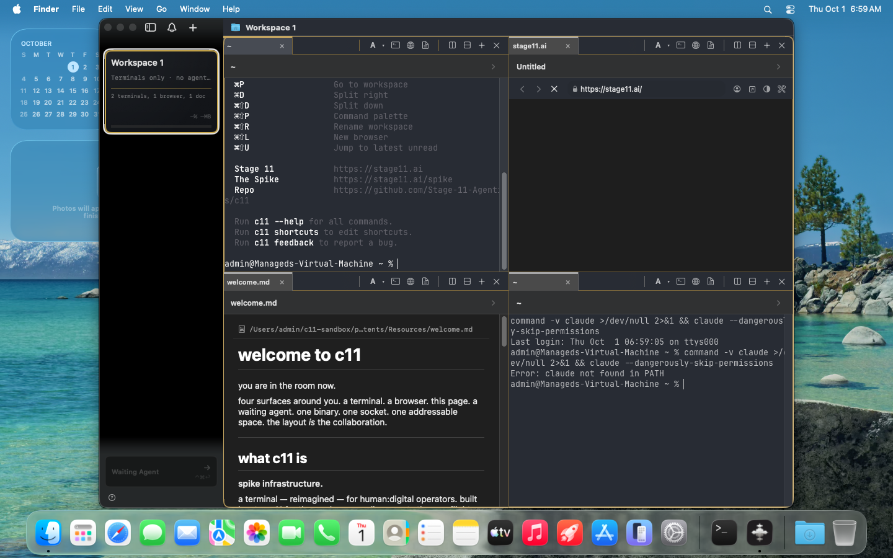

# Sandboxed c11 instances for computer-use validation

C11-244. Phase 1 was the research (2026-09-30). Phase 2 was approved on 2026-10-01: build the Tart design, with the VMs hosted on Atlas.

The failure this has to remove: synthesized clicks and drags against a tagged c11 build run in the operator's Aqua session, so they move the operator's cursor and key window. That happened on Hyperion on 2026-09-29. The sandbox has to give the validation run a different cursor and a different key window. Screenshots already have a safe path (`screencapture -l <windowid>`); the unsolved part is pointer and focus.

## Recommendation

Use a headless Tart macOS guest. One APFS clone per run, deleted afterward. The Tart host never opens a VM window. The agent drives the guest over SSH with the same `cliclick` / `osascript` / `screencapture` tools the computer-use skill already uses, posted into the guest's Aqua session. Copy a prebuilt tagged `.app` in. Do not build inside the guest.

The Tart host is `C11_SANDBOX_HOST`, default `atlas`. The scripts run on the operator's machine, SSH to that host, then SSH from the host into the guest. On 2026-10-01 Atin approved this design and moved the guests to Atlas (the phase 1 note said not to). A second local user, reached through Screen Sharing's virtual display, stays the fallback only if the Ghostty probe cannot allocate a GPU surface. That switch is a decision, not something the scripts do on their own. Do not use an in-session virtual display.

## This machine

Probed locally on 2026-09-30. Nothing below required sudo.

| Probe | Result |
|---|---|
| Host | Hyperion, `Mac16,6`, Apple M4 Max, 12 performance + 4 efficiency cores, 128 GiB RAM |
| OS | macOS 26.6.2 (build 25G83), Darwin 25.6.0 |
| Disk | APFS. `df` reports 637 GiB available on `/System/Volumes/Data`. Container free space 683.9 GB |
| Virtualization.framework | Present at `/System/Library/Frameworks/Virtualization.framework` |
| `tart`, `lume`, `utmctl`, `qemu-system-aarch64` | Not on `PATH`, not installed via Homebrew, no matching app in `/Applications` |
| `cliclick` | `/opt/homebrew/bin/cliclick` 5.1 |
| `vncdotool` | `/opt/homebrew/bin/vncdotool` |
| Local users | `atin` only (plus system accounts) |
| Screen Sharing | `com.apple.screensharing` is not registered in the system launchd domain |
| Tagged c11 app size | 105 MB for `c11 DEV c11-212.app`. `/Applications/c11.app` is 135 MB |

A 25 GB base image fits. An 8 GB guest is a small slice of 128 GB. Capacity is not the constraint on Hyperion. The constraint that still matters is Apple's two-guest cap. Ghostty's renderer does accept the guest GPU; that was measured on Atlas (below).

## Options

| | Tart macOS VM | Second login + virtual display | In-session virtual display |
|---|---|---|---|
| Isolation | Own kernel, WindowServer, cursor, `/tmp`, TCC | Own Aqua session and cursor. Shared kernel, GPU, and `/tmp` | Same session. Same cursor, same key window |
| Solves the 2026-09-29 collision | Yes, if the host runs the VM with `--no-graphics` | Yes, if input is posted in the other session and the console user is never switched | No |
| Boot / clone | Cold boot to SSH was 103s. `tart clone` of the golden image was 1s | Session comes up on VNC login. No multi-GB image | Instant. No image |
| GPU for Ghostty | Paravirtualized Metal. The v0.66.1 probe attached surfaces and drew terminals | Host GPU, full capability | Host GPU, full capability |
| License | Two running macOS guests per Mac, enforced by the framework | No extra macOS license | No extra license |
| Disk | ~25 GB golden, clones cheap until they diverge | A second home directory | None |
| Operator setup | Install Tart, pull one image, bake the golden once | Create a user, turn on Screen Sharing, grant TCC once | None, and it still fails the requirement |
| Agent can drive it from a script | Yes: SSH plus guest-side tools | Yes, with care: VNC or a process inside that session | Yes, and it steals the operator's cursor while it does |

Lume and UTM are the same Virtualization.framework substrate as Tart. They are covered under the VM column, not as a third isolation model. A hand-rolled `VZVirtualMachine` wrapper would reimplement Tart.

## 1. Virtualization.framework guest

Tart is the CLI in front of Apple's framework. Current docs: [tart.run quick start](https://tart.run/quick-start/). The GitHub project page currently resolves as [openai/tart](https://github.com/openai/tart) and its README says `brew install openai/tools/tart`. tart.run still says `brew install cirruslabs/cli/tart` and still publishes releases and images under `cirruslabs`. Phase 2 confirms which tap answers before anything is installed. Neither is installed here.

### What Tart already does that this ticket needs

- `tart run --no-graphics` does not open a host window. The flag's help text is "Don't open a UI window," for integrating VMs into other tools, and CI configs use it that way (`screen -d -m tart run … --no-graphics`). The guest still boots a full Aqua session. A third-party agent skill ([jonnyzzz/tart-skills](https://github.com/jonnyzzz/tart-skills)) already drives that session with `screencapture` and `cliclick` over SSH. That is the shape we want. It is someone else's skill, not a measurement on Hyperion.
- `tart run --dir=name:hostpath[:ro]` exposes a host directory over virtiofs. macOS guests mount it at `/Volumes/My Shared Files/<name>` (host and guest both need macOS 13 or newer; this host is 26).
- `tart clone` is an APFS copy-on-write. Tart's own clone command says a clone does not claim the full disk until the guest writes. Deleting the clone throws the run away.
- Default VM shape is 2 CPUs, 4 GB, and a 1024×768 display. That display is too small for the computer-use skill's readability bar. `tart set --cpu 4 --memory 8192 --display 1440x900` is the phase-2 default (display values are points for a macOS guest; the parser lives in Tart's `Set` command).
- `tart set --random-mac` and `tart set --random-serial` issue a new MAC and a new `VZMacMachineIdentifier`. Apple treats two running guests that share a machine identifier as undefined. A clone keeps its golden image's serial and only randomizes the MAC. There are two golden images, `c11-sandbox-golden` and `c11-sandbox-golden-b`, each with its own serial. `sandbox-up` clones whichever one no running guest came from, so two running guests never share an identifier. Golden images are stopped, and the scanner VMs have their own identifiers. `--random-serial` is only a fallback, for a host without the second golden image.
- Base image: `ghcr.io/cirruslabs/macos-tahoe-base:latest`. tart.run says the pull is 25 GB. The published images ship with a well-known account password. The golden image turns password login off, installs the sandbox key, and stores a random account password at `~/.c11-sandbox/guest-password` on the Tart host (mode 600). NAT is the default, so the guest is reachable from the host.
- `tart exec` (guest agent, user launch agent) can run a command without SSH. Confirm the Tahoe base image actually ships that agent during golden-image setup. SSH is the documented path and the one the scripts should depend on.

`tart run --suspendable` has existed since the Sonoma-era Tart 2.0 notes: resume a host-local encrypted snapshot instead of a cold boot, and `tart push` does not upload that snapshot. Cold-boot duration was not measured here. Disposable clones of a stopped golden are the right default, because a resumed snapshot is a dirty machine. If phase 2 times a cold boot and it is too slow, suspend becomes an optimization on top of the clone, not the source of truth.

UTM (`utmctl`) uses the same framework for macOS guests, with the same two-guest cap and the same GPU. It is a GUI app and it is not installed. Lume ([trycua/cua](https://github.com/trycua/cua)) is the same framework plus an unattended Tahoe preset (user, SSH, auto-login, sleep and lock disabled) and an HTTP API for screenshots and clicks. Lume's own limits page states the two-guest cap. Its installer is a curl pipe, telemetry is on unless disabled, and the CLI moves quickly. The computer-use skill already speaks `cliclick` and `screencapture`, so Tart plus SSH matches it with less new surface. Use Lume's unattended checklist as the golden-image contents. Switch to Lume only if `tart exec` and SSH both fail to reach the Aqua session.

### Metal, and why Ghostty might still fail

A macOS guest gets a paravirtualized GPU: the guest submits Metal, the host runs it on the real GPU. Cua measured a stock Tahoe guest (macOS 26.5.2, Lume 0.5.1, M1 Ultra host on macOS 26.6.1) and the device reported an Apple 5-era family, 32 KB maximum threadgroup memory, and no SIMD-group matrix support ([Cua, 2026-08-11](https://cua.ai/blog/gpu-passthrough-macos-vms)). Lume's docs describe the same limit as GPU Family 5. That is enough for ordinary terminal compositing. It is not a passthrough of the M4 Max.

c11's renderer does not have a software fallback that matters here. With the host screen locked, WindowServer refuses the GPU-backed surface and `ghostty_surface_new` returns `error.OutOfMemory` (repo note in `CLAUDE.md`, from the C11-238 run). The guest must present an unlocked virtual display whose WindowServer will allocate those surfaces. Auto-login and a disabled lock screen, which Tart's own from-scratch guide already requires, are part of the golden image for that reason.

This was not booted on Hyperion. Phase 2's first real action is the probe below, before the skill starts sending agents into the VM. Family 5 is evidence the GPU exists, not evidence Ghostty's shaders accept it.

### Getting the tagged app in, and driving it

Copy, don't build. A tagged debug app is about 105 MB. Mount the host's DerivedData product directory read-only, copy the `.app` onto the guest disk, clear `com.apple.quarantine`, and launch it inside the guest. Building inside the guest would put an `xcodebuild` on Hyperion, which this run is not allowed to do, and it would still be the host's CPUs.

Launch with the same contract as `scripts/launch-tagged-automation.sh`: strip inherited `C11_*` / `CMUX_*`, set `C11_SOCKET_MODE=automation`, `C11_QA_LAUNCH=fresh`, and a guest-local socket under the guest's `/tmp`. The host does not talk to that socket. The host SSHs `c11` commands so they hit the guest CLI. `open -g` on the host must never be pointed at a guest path.

Input and screenshots:

1. Preferred: SSH, then `launchctl asuser <guest-uid>` so `cliclick`, `osascript`, and `screencapture` run in the guest Aqua session. That session is the guest's console, which is a virtual display. Nothing in that path posts a host `CGEvent`.
2. Fallback: `tart run --vnc` (or the guest's own Screen Sharing on 5900) and the host's existing `vncdotool`. Do not open Screen Sharing.app on the host. That would be a host window.

### License, and the two-guest cap

The license installed on this Mac (`Setup Assistant.app/.../en.lproj/OSXSoftwareLicense.html`, macOS 26.6.2) section 2B(iii) allows up to two additional copies or instances of macOS in virtual operating systems on each Apple-branded computer, for software development, testing during software development, macOS Server, or personal non-commercial use. Validation of c11 is the testing purpose. The same section bars service-bureau and time-sharing use. This is not that.

The framework enforces the count. A third macOS guest fails with `VZErrorDomain` code 6, `VZError.virtualMachineLimitExceeded` ("The maximum supported number of active virtual machines has been reached"). Howard Oakley documented that as a license limit rather than a hardware limit in 2022, on a 128 GB Ultra that still stopped at two ([Eclectic Light Company](https://eclecticlight.co/2022/08/04/virtualisation-on-apple-silicon-macs-8-how-apple-limits-vms/)). Apple's current `VZError.virtualMachineLimitExceeded` docs still describe the same code. A June 2026 Apple Developer Forums report (macOS 26.5, M4 Max) says a guest-initiated shutdown sometimes does not return the slot until the host reboots. The script must count running guests before clone-and-boot, and a stuck slot is an operator-visible failure, not something to route around with a boot-arg.

Disk images on disk are not the cap. Running guests are. Default the script to one running clone. Allow a second only when two validations genuinely overlap. Never start a third.

### Host footgun

Tart's FAQ: from macOS 15 on, Virtualization.framework wants the host's login keychain unlocked while a guest starts, and a locked keychain fails with a Security Server / key-generation error. Hyperion is normally logged in and unlocked. A locked screen can fail the VM start the same evening it already fails host-side Ghostty. The script should report that error as "host keychain locked," not retry in a loop.

## 2. Second login session

Fast user switching is the wrong control. It makes the other user the console user, which puts their desktop on the built-in display and attaches the keyboard and pointer. That steals the operator's screen instead of protecting it. The script must not call a session switch.

The supported off-console path is a virtual display for a different user:

- Apple Remote Desktop's control-and-observe settings distinguish "share the display" from "connect to a virtual display." In the virtual-display case you see the desktop of the account you authenticated as, and the person at the console keeps working. [Apple's Remote Desktop guide](https://support.apple.com/guide/remote-desktop/apd4f46319e/mac).
- Built-in Screen Sharing has offered a concurrent login ("Log In" rather than "Share Display") since OS X Lion. The current macOS 26 help page for turning Screen Sharing on does not restate that dialog. Phase 2 has to confirm, on 26.6, that a localhost VNC login as the sandbox user does not raise a permission dialog on the console and does not move the console cursor.

On this Mac that path is not set up: one human user, Screen Sharing off.

What it costs:

- Create `c11sandbox`, log it in once, turn on Screen Sharing for that user only, and click through Accessibility (and Screen Recording, if the screenshot helper needs it). TCC is per user and the first grant is a GUI click. The same grant exists inside a VM golden image. Cua's driver guide says the same thing: SIP does not pre-grant Accessibility or Screen Recording.
- The driver must run as that user, inside that session (`launchctl asuser` there, or VNC into that session). `cliclick` from the operator's shell posts into the operator's session. That is the bug again.
- The session is headless only from the console's point of view. It is still an Aqua session with a virtual framebuffer. A pure SSH login is not Aqua, and Ghostty will not create a surface there.
- `/tmp` is shared with the operator. Tagged sockets (`/tmp/c11-debug-<tag>.sock`) and `/tmp/c11-build.lock` live there. A VM has its own `/tmp`.
- A runaway validation can still fill the disk and peg the GPU. The kernel is the operator's kernel.
- Screen Sharing is a network service. Restrict it to the sandbox user. Prefer a localhost client (`vncdotool` is already installed) over opening a window.

The Ghostty probe succeeded, so this path is not the plan. It stays the fallback only if a later probe hits `error.OutOfMemory`. It is the option with the weakest blast-radius isolation.

## 3. In-session virtual display

`CGVirtualDisplay` (private) adds a display to the current Aqua session. It does not add a session. This session has one cursor and one key window. A drag on the extra display moves the cursor the operator is holding, and activating the validation window takes key focus. That is the 2026-09-29 collision with an extra monitor attached. The computer-use skill already says a synthesized drag owns the pointer for its whole duration.

Window-id screenshots stay the right tool for "look without touching." They do not need a virtual display. This option is out.

## Atlas

Phase 1 recommended keeping the guest on Hyperion. Phase 2 moved it to Atlas: the cursor that must stay put is still Hyperion's, and a guest on another machine protects it the same way, without putting VM CPU on the laptop. Atlas is one Apple-silicon Mac, so it has the same two-guest cap. The scripts default to `ssh atlas`. Set `C11_SANDBOX_HOST=local` to run Tart on the machine where the script is invoked.

The app source is pluggable. Today it is `local-app`: a `.app` on the machine running the script, copied to Atlas, then into the guest. `--app-source atlas-build` is the later source, a branch built on Atlas. It is not implemented. `sandbox-up` does not install Xcode and does not wait for it. Both sources have to leave one `.app` in `~/.c11-sandbox/apps/<run-id>/` on the Tart host. The boot path only reads that directory. Long image pulls run detached on Atlas. Do not reboot Atlas to clear a stuck VM slot; that takes the always-on services down with it. Scanner VMs already on the machine (`scanner-base`, `scanner-golden`) are left alone.

## Scripts

The scripts run on the laptop (or wherever you invoke them) and talk to the Tart host over SSH. They refuse to download an image or install Tart. If `tart` is missing or `c11-sandbox-golden` is missing, they exit and do nothing else. The golden image is never booted for a run. State on the Tart host lives under `~/.c11-sandbox/` (run metadata, the copied `.app`, screenshots, test logs). The guest SSH key is `~/.ssh/c11-sandbox` on that host. It is not in this repo.

`scripts/sandbox-up.sh <run-id> <path-to-tagged.app> [--allow-second]`

`--app-source` (or `C11_SANDBOX_APP_SOURCE`) selects the source. `local-app` is the default and takes the path above. `atlas-build` exits before SSH. The run metadata records `APP_SOURCE`.

- Take a mkdir lock at `~/.c11-sandbox/clone.lock` around the running-guest count and the clone. A dead owner's lock is replaced. An empty pid file is still being written, so a waiter retries instead of taking the lock. The lock is released once `tart list` shows the new guest as not stopped, so the SSH session is not held for the rest of boot.
- Refuse if any guest is already running, unless `--allow-second` is passed, and refuse always if two are already not stopped. A suspended guest counts, because it can still hold a macOS VM slot.
- Pick the golden image no running `c11-sb-*` guest came from: `c11-sandbox-golden` first, else `c11-sandbox-golden-b`. The choice goes in `runs/<run-id>/golden` under the clone lock, before boot, so a concurrent `sandbox-up` sees it. A guest with no record counts against the first golden.
- `tart clone <golden> c11-sb-<run-id>`
- `tart set` always passes `--random-mac`. It passes `--random-serial` only when neither golden image is free, which means the second one is missing. Then Setup Assistant can show.
- `tart run --no-graphics --no-audio --no-clipboard --dir=out:<artifact-dir>` is started in a new session with stdin closed and stdout on the run log, so the SSH session can exit while the VM keeps running. The `.app` goes in over SSH, not through that share.
- On EXIT, INT, or HUP during a failed boot, the script stops and deletes the clone and removes the staged `.app`. A run id that already has a VM exits before that cleanup, so the live clone and its staged app stay. If the session drops before the trap runs, `scripts/sandbox-down.sh <run-id>` is the recovery.
- Wait until `tart ip` answers and SSH accepts the key.
- Copy the `.app` into the guest with `tar` over SSH, strip quarantine, and launch the binary in the guest Aqua session. The app is not read from virtiofs: that share turns Sparkle and Sentry framework symlinks into loops and `ditto` fails. The `out` share stays virtiofs, for screenshots and logs. `launchctl asuser` has to run as root to enter that session, and it does not change uid, so the scripts then `sudo -u` the console user. Otherwise the process and its socket are root-owned and the CLI refuses the socket. Environment matches `launch-tagged-automation.sh`: inherited `C11_*` / `CMUX_*` removed, `C11_SOCKET_MODE=automation`, `C11_QA_LAUNCH=fresh`, `C11_ALLOW_SOCKET_OVERRIDE=1`, socket `/tmp/c11-sandbox-<run-id>.sock`. The golden image gives `admin` passwordless sudo. A password prompt would hang a run.
- Print the run id, the guest IP, the guest socket, and the clone and boot times. Do not print the SSH private key.

`scripts/sandbox-exec.sh <run-id> <command> [args...]`

- SSH as the guest user, `launchctl asuser` into the Aqua session, run the command. This is how `cliclick` and menu `osascript` are invoked. Exit status is the remote status. A pipeline is `sandbox-exec.sh <run-id> zsh -c 'cmd | other'`.

`scripts/sandbox-shot.sh <run-id> <host-png> [screencapture args...]`

- `screencapture` in the guest Aqua session (default `-x`, the whole guest display). Extra arguments such as `-l <windowid>` are passed through. The PNG is written into the shared `out` directory and copied back to `<host-png>`.

`scripts/sandbox-down.sh <run-id>`

- `tart stop` the clone, then `tart delete c11-sb-<run-id>`. Refuse to delete `c11-sandbox-golden` or a `scanner-*` VM. Removes the staged `.app` and, when the clone lock belongs to this run or its owner is gone, the lock. Screenshots and logs under `~/.c11-sandbox/out/<run-id>` stay. This is the recovery when `sandbox-up` is cut off.

`scripts/sandbox-tests-v2.sh <run-id> [tests_v2/test_file.py ...]`

- Requires `sandbox-up` to have launched the app. Copies `tests_v2/` (and `tests/fixtures` when that tree exists) into the guest and runs the python3 scripts there against the guest socket. With no file arguments, runs every `tests_v2/test_*.py` except `test_ctrl_interactive.py`. Flags such as `-k` are rejected: this suite is not pytest. The guest relaunches its c11 once before each file. A failing file does not stop the rest. The run ends with `summary passed=N failed=M`. The suite has to match the app build: after #472 the tests address surfaces by area and tab names, so an older app fails those files for real. Stdout streams back, and a copy of the log is left at `~/.c11-sandbox/out/<run-id>/tests-v2.log` on the Tart host.

`skills/c11-computer-use/SKILL.md` sends any click, drag, or activation through these scripts. The operator's own session stays on socket/CLI oracles and `screencapture -l`.

### Ghostty probe

Done on the golden image, 2026-10-01, with the public release `v0.66.1` (`c11-macos.dmg`), not a laptop build. The app was launched in the guest Aqua session with the automation environment. `c11 debug-terminals` reported `runtime=1` and a non-nil `ghostty=` pointer on two terminal surfaces, and the guest display showed shell prompts in those panes. No `error.OutOfMemory`.

The first launch ran as root, because `launchctl asuser` keeps the caller's uid. The CLI then refused the socket (`not owned by the current user`). Relaunching through `sudo -u admin` after `asuser` fixed ownership, and the same `debug-terminals` check passed without a chown. The screenshot above is that second launch. The probe app was deleted from the golden disk before shutdown.

## Operator setup, once

Done on Atlas for `c11-sandbox-golden`. A new host repeats this; the scripts do not.

1. Tart 2.32.1 was already installed at `/opt/homebrew/bin/tart`. It was left in place. See the license section.
2. `tart clone ghcr.io/cirruslabs/macos-tahoe-base:latest c11-sandbox-golden`. The host login keychain was unlocked; this boot did not hit `SecKeyCreateRandomKey`.
3. `tart set c11-sandbox-golden --cpu 4 --memory 8192 --display 1440x900`, then one headless boot (`tart run --no-graphics --no-audio --no-clipboard --vnc-experimental`).
4. Guest is macOS 26.6.2. Auto-login was already `admin`. Sleep and display sleep are off, and the screensaver idle time was already 0. `cliclick` 5.1 is installed. `/usr/bin/python3` is 3.9.6. `admin` has passwordless sudo, which the scripts depend on.
5. SSH key `~/.ssh/c11-sandbox` on Atlas is installed in the guest. Password authentication, keyboard-interactive, and challenge-response are off. The account password is a random value in `~/.c11-sandbox/guest-password` on Atlas, mode 600. Auto-login reads the same password from `/etc/kcpassword`. The grant notes read the password from that Atlas file. Do not commit the key or the password.
6. The base image already allows Accessibility, Screen Recording, and PostEvent for `/usr/libexec/sshd-keygen-wrapper`, `/usr/bin/osascript`, and the Tart guest agent. `cliclick` and a full-display `screencapture -x` work over SSH. `screencapture -l` raised a separate prompt for `com.apple.sshd-session`. That prompt was dismissed during the probe and did not add a TCC row, so a window-id capture may ask again. The default shot is full-display `-x`.
7. The golden image is stopped. Runs clone it. Nobody boots it to do validation. After the password rotation the guest was rebooted once: the console user was `admin`, Finder was frontmost, and the golden image was stopped again.
8. A clone keeps the golden serial, so Setup Assistant does not run. A new serial brings it back: loginwindow sets its `MiniBuddyLaunch` pref and runs the post-setup panes (software update, Apple Account, FileVault, Welcome). Do not `killall "Setup Assistant"`; that took a guest session down. There is no installed configuration profile for this. `profiles install` is gone on macOS 26.6.
9. The second golden image, for a second concurrent guest (2026-10-02): `tart clone c11-sandbox-golden c11-sandbox-golden-b`, `tart set c11-sandbox-golden-b --random-mac --random-serial`, one headless boot, then clear the panes once in the guest Aqua session with `cliclick`: Only Download Automatically, Other Sign-In Options > Sign in Later in Settings > Skip, FileVault Not Now > Continue, Get Started. Every pane accepted the synthesized click. Quit System Settings, reboot once to confirm the desktop comes up with no Setup Assistant, and shut it down. Its serial is fixed from then on, so its clones skip setup the same way.

## Tart on Atlas: source and license

Checked on Atlas during phase 2, against the binary that is actually installed.

| Fact | Result |
|---|---|
| Version | 2.32.1 (`CFBundleShortVersionString`) |
| Bundle id | `com.github.cirruslabs.tart` |
| Binary | `/opt/homebrew/bin/tart` → `/Applications/tart.app/Contents/MacOS/tart` |
| How it got there | Already installed before this ticket. It is not a current Homebrew cask (`/opt/homebrew/Caskroom/tart` is absent) and `brew list --cask` does not name it. The `cirruslabs/cli` tap is present, but its `tart.rb` formula does not evaluate (`depends_on :macos` at line 22), so `brew info tart` fails. The working app was left as it was. |
| License file in the app | None. `Contents/` has `Info.plist`, `MacOS/tart`, and `Resources/` (icon and asset catalog only). |
| License of this version | Tag `2.32.1` of [cirruslabs/tart](https://github.com/cirruslabs/tart) is **Fair Source License 0.9**, copyright 2023 Cirrus Labs, Inc. Use limitation: 100 users, where a user is one CPU core used by the product. That limitation does not apply to CPUs in a device used by a single individual. |
| Upstream main | The GitHub project page now resolves as [openai/tart](https://github.com/openai/tart). Its README installs `brew install openai/tools/tart`, and `main` carries the Functional Source License 1.1 (Apache-2.0 future license). tart.run still documents `brew install cirruslabs/cli/tart` and the image `ghcr.io/cirruslabs/macos-tahoe-base:latest`. |

The binary we run is 2.32.1, so the Fair Source 0.9 text is the one that applies, not the license on `main`. Our use fits. Atlas is one person's machine, which is the single-individual exception, and an M2 Ultra is also well under 100 cores. c11 does not redistribute Tart, ship it, or offer it as a service. Internal validation clones are the permitted use.

## Measured on Atlas

Numbers below are the ones this phase actually observed.

| Measurement | Result |
|---|---|
| Host | Atlas, M2 Ultra, 128 GB, macOS 26.5.2. About 321 GB free before the pull. 284 GiB free on `/System/Volumes/Data` after the golden image existed. |
| Base image | `ghcr.io/cirruslabs/macos-tahoe-base:latest`, cloned as `c11-sandbox-golden`. Tart reported the disk layer as 27.3 GB compressed. |
| Golden image | 4 CPU, 8192 MB, 1440×900. `du -sh` of `~/.tart/vms/c11-sandbox-golden` is 31G. `~/.tart` is 120G, which includes the OCI cache and the stopped scanner VMs. |
| APFS clone time | 1 second (`tart clone c11-sandbox-golden c11-sb-measure`, then deleted). `du` still reports 31G for a fresh clone because the extents are shared. |
| Cold boot to SSH | 103 seconds on the first golden boot (epoch 1790837076 to the first successful SSH at 1790837179). |
| Warm clone, tart run to socket | `sandbox-up` on a warm host reported `clone_secs=0` and `boot_secs=27` for `c11-sb-ghostty1`, through SSH and app launch to a live socket. A later Atlas-local `sandbox-up ghostty2` (app already staged on the host) reported `clone_secs=0` and `boot_secs=50`. |
| Attached terminal | Once the process was the console user, `debug-terminals` showed `runtime=1` and a live `ghostty` pointer about 1 second after launch. The screenshot is above. |
| tests_v2 in the guest | From the laptop, `sandbox-tests-v2.sh ghostty2 tests_v2/test_cli_id_format_defaults.py` copied the suite to Atlas, relaunched c11 in the guest, and passed both of that file's assertions against the guest socket. Wall time was about 17 seconds. |
| Single clone, default SSH path | From the laptop with `C11_SANDBOX_HOST` unset, `sandbox-up repair1` of a released `.app` returned `clone_secs=0` and `boot_secs=29` while `tart run` stayed up after that SSH session closed. `docs/images/c11-244-no-setup.png` is the guest display: Aqua, Finder, c11, System Settings restored from the golden image, no Setup Assistant. One `cliclick` on the System Settings close button closed that window. `docs/images/c11-244-click.png` is the display after, with the four terminals in front. `sandbox-down repair1` then deleted the clone. The golden image and both scanner VMs stayed stopped. |

## Fallback: a clone that still shows Setup Assistant

Only for a clone whose golden image has no serial of its own (an older image, a missing `c11-sandbox-golden-b`, or the `--random-serial` fallback). Both current golden images keep their own serial and boot to the desktop, so this should not happen. The sign: the probe preflight fails at `Exact tagged PID is frontmost` with every identity check green, and a read-only `screencapture -x -D 1` plus `NSWorkspace.frontmostApplication` reads `Setup Assistant` (measured 2026-10-02, C11-266). With the operator's go, in your own disposable guest only, step it with single `cliclick c:X,Y` pointer clicks, one capture after each (guest points are screenshot pixels / 2), and wait for each pane to finish drawing before the next click (the first click on a new pane can only focus it):

1. Update Mac Automatically: Only Download Automatically.
2. Sign In to Your Apple Account: Other Sign-In Options, Sign in Later in Settings, then Skip. Nothing signs in.
3. FileVault: Not Now, then Continue.
4. Welcome: Get Started.

Then Accessibility already lists `sshd-keygen-wrapper`, `osascript` and `tart-guest-agent` as on. The first scripted key can raise a one-time "sshd-keygen-wrapper would like to control this computer" sheet: choose Open System Settings, confirm the toggle is on, close Settings. No grant is needed.

## Measured probe gotchas

- Send Escape and shortcuts with System Events `key code`, scoped to the PID. `cliclick kp:esc` is not seen by c11's key monitor.
- A System Events walk of c11's window tree takes about 18 s and drops the popover, so it cannot read Feed rows. Use `tests_v2/feed_quick_view_keyboard_probe.py` (keys, socket state and screenshots, no tree walk).
- c11's own "Turn on notifications for c11" sheet can take Return mid-run. Decline it with its Not Now button (never Open Settings) before the scenario.
- The `out` share can serve a stale copy of a file you just replaced. Stage probes under a new directory name and compare the guest `md5` with the host.
- A relaunched tagged app can open 48 px off the display; place it with System Events (`position {0, 30}`, `size {1024, 680}`) before a probe that checks window bounds.
- `sandbox_guest_script` and the helpers need `bash`; `zsh` fails on `BASH_SOURCE`.

## Agents in the guest

C11-322. Live proofs that need real agent tabs run in the guest, so the laptop's screen lock, focus, and CPU are out of the path.

`scripts/sandbox-up.sh <run-id> <app> --agents claude,codex,grok` boots the clone as above, then runs `scripts/sandbox-agent.sh <run-id> stage <kinds>`. A staging failure fails `sandbox-up` and removes the clone.

**CLIs.** Stage copies the agent binaries installed on the Tart host into the clone (`/usr/local/libexec/c11-sandbox/<kind>`, linked from `/usr/local/bin`, which is on the guest login PATH behind c11's wrappers). The version is recorded in the run's `agents.env`. Claude runs with `DISABLE_AUTOUPDATER=1` so it stays on that version. The golden image stays minimal and is never booted to install anything.

**Credentials.** Atin's decision (2026-10-02): reuse the Overwatch seat credentials, no new logins. On the Tart host, `seat.sh export-cred --agent <kind>` (Overwatch launcher) runs the same `kind_credentials` a Prime seat gets: the Claude setup-token for a call-sign, checked against the account it bills (default Alpha; `C11_SANDBOX_CLAUDE_ACCOUNT` overrides); an access-only Codex `auth.json` from the dedicated seat login (no refresh token); a Grok access token from the dedicated seat login (about 6 hours). The JSON stays in the host shell's memory and goes to the guest on SSH stdin, where a stager writes:

| Kind | Guest file (mode 600) | How the CLI reads it |
|---|---|---|
| Claude | `~/.c11-sandbox-secrets/claude-oauth` | A `claude` shim exports `CLAUDE_CODE_OAUTH_TOKEN`; Claude has no file login on macOS |
| Codex | `~/.codex/auth.json` | Codex's own file store |
| Grok | `~/.c11-sandbox-secrets/grok-token` | `auth_provider_command` runs `grok-auth`, which prints it |

First-run state is seeded the way prime-seat-image seeds a box (onboarding, trust for `~/c11-sandbox/work`, bypass acceptance, no update checks, Grok always-approve and telemetry off). Rerun `stage` to refresh; Grok's token is the one that expires.

**The invariant.** No secret persists in the golden image or outlives its clone: secrets are exported only on the Tart host, are never in argv, a host file, or a log, live in the guest only on the clone's disk, and leave with `tart delete`. `sandbox-down` first runs `sandbox-agent.sh <run-id> wipe`. After it, `sandbox-agent.sh <run-id> verify-clean` checks that the clone and its VM directory are gone, that the golden `disk.img` mtime has not moved since staging, and searches that disk and the host's `~/.c11-sandbox` for every staged value. The values are re-exported and fed to the scanner on stdin, the scanner reads only allocated extents at nice 15 (the 32 GB golden image takes about 30 s), and it prints only found, absent, or error. An unreadable file or failed read is an error, never an absence, and a staged value that has since rotated (it can no longer be exported, so it cannot be searched for) fails the check: neither can be certified clean. `verify-clean --control`, run while a clone is up, must find the values on that clone's own disk: it proves the search can see guest files (the guest disk is not FileVault-encrypted), so an absent on the golden image means something.

**Driving agents.** `sandbox-agent.sh <run-id> launch <kind> <brief>` copies the brief into the guest and runs the guest's `c11 launch-agent --prompt-file`, so the agent gets a file pointer. It sets `mailbox.address` to the title and `mailbox.delivery=stdin`, steps the known first-run screens, and waits for the composer. `sandbox-agent.sh <run-id> c11 …` runs any guest CLI command against the guest socket; `screen` is `read-screen`. Mailbox traffic is per workspace, so send mail from a shell tab inside the guest workspace (`c11 send` a `c11 mailbox send …` line into it), as an operator would.

**Measured on Atlas, 2026-10-02.** C11-257 sign-off steps 3-8 passed in one guest for Claude (Bravo) and Codex: waiting mail by push, busy mail after the turn (Claude by Stop-hook drain, Codex by push at the idle edge), the awkward title by `recv --drain`, and an operator draft (`send --raw --no-submit`) left intact with the mail delivered as its own turn after the draft's turn. Each envelope was delivered once. `verify-clean --control` found the staged values on the live clone's disk; after `sandbox-down`, `verify-clean` found none on the golden disk or the host tree. Copying the three CLIs (claude 2.1.287, codex-cli 0.159.3, grok 1.0.46, about 750 MB) and staging took about a minute; restaging with the CLIs already present takes seconds. All three agents started logged in. Claude on Alpha and Grok were at their weekly limits that day and showed the provider's limit screen instead of answering: a logged-in agent with no quota looks like a stuck one until you read its screen.

**Gotchas.**
- The Tart host's Homebrew `codex` carries `com.apple.quarantine`; executing it over SSH hangs in Gatekeeper's first-launch check (stuck at `_dyld_start`). Stage reads Codex's version from the cask's `codex-package.json` and never runs it on the host. The guest copy has no xattrs and runs.
- The host and guest scripts run as `zsh -s` with the script on stdin. A child that reads stdin swallows the rest of the script; give such children `</dev/null`.
- Uploading a 100 MB app from the laptop to Atlas can stall mid-stream. The remote build already left the app on Atlas, so run the scripts there with `C11_SANDBOX_HOST=local`.

## Open risks

- Ghostty on Family 5 Metal worked for the v0.66.1 probe (attached surfaces, visible shell prompts). A later guest OS or a different c11 build can still fail the same way a locked host screen fails: `ghostty_surface_new` returns `error.OutOfMemory`. Treat that as a stop, not a reason to switch designs inside a run.
- Two running guests is a hard cap. A stuck `VZError` slot after shutdown has been reported on macOS 26.5 on an M4 Max and is only cleared by rebooting the host.
- `tart run` can fail while the host login keychain is locked.
- Password SSH is off. The account password is in `~/.c11-sandbox/guest-password` on Atlas (mode 600), which is also what auto-login uses. The scripts use the SSH key, not the password. Do not commit that file.
- Any clone with a new serial shows Setup Assistant. Both golden images keep their own serial, so neither guest does.
- Two running clones of the same golden image would share a machine identifier. `sandbox-up` never starts one; it falls back to `--random-serial` when both golden images are in use or the second is missing.
- Second-user fallback is unverified on 26.6: localhost VNC as another user must not prompt or steal the console. Screen Sharing would be a new network service on the operator's Mac.
- Guest macOS will drift from the host. Rebuild the golden image deliberately. Do not let a run update it.
- Lightweight macOS guests still have App Store and some Apple-ID limits. c11 dev builds do not need those. iCloud sign-in is out of scope.
