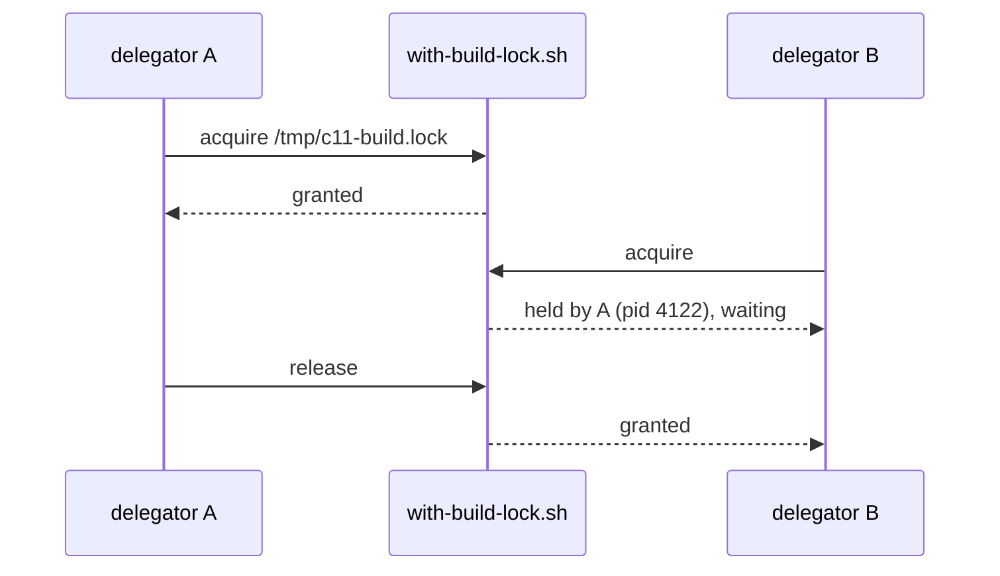

# c11 pitfalls — reader specimen

The fixtures carry no GitHub callouts and no footnotes, so this page assembles real rules from c11's `CLAUDE.md` into the shapes the renderer has to handle: all five callout kinds, footnotes, a task list, a table, a small diagram.

## Screen lock blocks terminal creation

> [!WARNING]
> No c11 on this machine can open a terminal while the Mac's screen is locked. Every new terminal surface stays unattached, and the ghostty log shows `embedded_window: error initializing surface err=error.OutOfMemory`.

RAM, file descriptors, process and thread counts, Metal, and IOSurface all look healthy from a shell, so do not spend time ruling them out.[^lock] With the screen locked, WindowServer refuses the GPU-backed surface the renderer needs and ghostty reports the refusal as an allocation failure.

> [!TIP]
> Unlock the screen. Surface creation resumes at once and queued `send` payloads flush on attach. If a delegator's tagged-build validation hits this, park it and ask the operator to unlock.

## Modals on agent-reachable paths

`NSAlert.runModal()` spins a nested run loop on main and blocks every terminal, pane, and agent until a human dismisses it. Socket commands run their work through `v2MainSync`, so the modal loop ends up inside a `DispatchQueue.main.sync`.[^modal]

> [!CAUTION]
> A `runModal()` on any path an agent can reach wedges the whole app. The browser insecure-HTTP prompt once held main for up to 6.8 hours.

> [!NOTE]
> It is fine for an alert the operator just triggered from a menu or button. For browser modals use `browserPresentModalAlert` in `Sources/Panels/BrowserPanel.swift`, which sheets onto a usable window and applies a safe default when there is none.

## Long-lived threads drain a pool per iteration

A `Thread`'s root pool only drains when the thread exits, so every autoreleased object its Foundation calls leave behind stays alive until then, and `leaks` won't flag it because the pool still references it all.[^pool]

```swift
while running {
    autoreleasepool {
        let data = try? JSONSerialization.data(withJSONObject: payload)
        handle(data)
    }
}
```

> [!IMPORTANT]
> c11's long-lived threads are the socket accept loop, each per-connection `handleClient` thread, and the hang-monitor watchdog. Any new one needs the same drain.

## One build per machine

| Entry point | Lock | Bypass | Notes |
|---|---|---|---|
| `scripts/reload.sh` | `/tmp/c11-build.lock` via `with-build-lock.sh` | `C11_BUILD_LOCK=0` | Reports the lock owner every 30 s, takes over a lock whose owner died, gives up with exit 75 after 90 minutes. |
| `scripts/test-unit-local.sh` | same | same | Exports a per-PID `C11_SOCKET_PATH` so the XCTest host never binds the operator's socket. |
| bare `xcodebuild` | none | n/a | Never call it bare. Two concurrent builds each spawn a swift-frontend per core and the load average goes into the hundreds. |



## Before calling a skill edit done

- [x] Edit the source under `skills/<name>/`
- [x] Commit the change
- [ ] Run `scripts/sync-installed-skills.sh <name>`
- [ ] Verify the live copy under `~/.claude/skills/<name>/`

---

[^lock]: C11-238 run, 2026-09-26. The same failure appears in production c11 and in every tagged DEV build alike.
[^modal]: C11-204. The fix routes browser modals through a sheet with a safe default so no socket command can wait on a human.
[^pool]: C11-211: one held socket connection pinned roughly 3 GB a day of JSON buffers.
